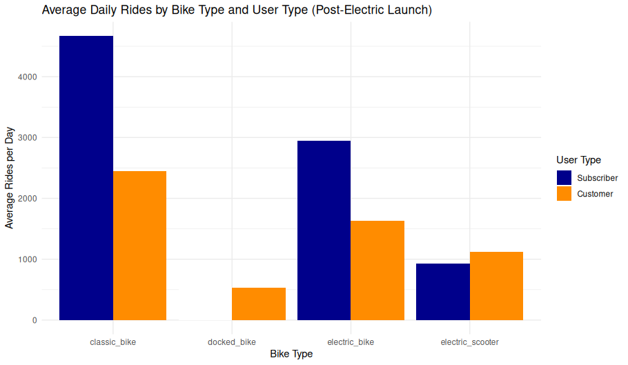

## Image Notes: Average Daily Rides by Bike Type and User Type (Post-Electric Launch)

<figure class="float-right">
  <a href="../Avg_Daily_Rides_by_Bike_and_User_Type_post_elec.png" target="_blank" title="Select image to open full sized chart">
  
  </a>
  <figcaption>
  FIGCAPTION
  </figcaption>
</figure>

### Overview
This bar chart displays the **average number of daily rides** by **bike type**, grouped by **user type** (Subscriber vs. Customer), for the period after the introduction of electric bikes and scooters.

### Axes and Groupings

- **X-Axis (Bike Type)**:
  - `classic_bike`
  - `docked_bike`
  - `electric_bike`
  - `electric_scooter`

- **Y-Axis (Average Rides per Day)**:
  - Ranges from 0 to over 4,500 rides per day.

- **Color Legend**:
  - **Red** = Subscriber
  - **Teal** = Customer

### Observations

- **Classic Bikes**:
  - Most used overall.
  - Subscribers (red) significantly outnumber Customers in ride volume.

- **Docked Bikes**:
  - Very low usage overall.
  - Only Customers use docked bikes in this dataset — Subscribers have no visible rides.

- **Electric Bikes**:
  - Popular among both user types.
  - Subscribers still dominate, but the Customer share is substantial.

- **Electric Scooters**:
  - Slightly more popular with Customers than Subscribers.
  - Total volume is lower than bikes but non-trivial.

### Interpretation

- **Subscriber Preference**:
  - Strongly favors classic and electric bikes.
  - Likely reflects commuting and utilitarian travel patterns.

- **Customer Preference**:
  - More evenly spread across bike types.
  - Higher share of docked bike and scooter usage, suggesting casual or occasional use.

- **Modal Shift**:
  - The presence of electric modes (bike and scooter) introduces significant usage from both user groups, possibly pulling some traffic away from classic bikes.

### Use Case

This visualization supports:
- Infrastructure planning (e.g., expansion of electric charging or docking stations),
- Marketing strategy (targeting modal preferences by user type),
- Evaluating post-launch success of electric mobility options.


```R
post_electric_rides_df <- dbGetQuery(con, "SELECT
   DATE(start_time, 'unixepoch') AS ride_date,
   user_type,
   bike_type,
   COUNT(*) AS ride_count,
   AVG((end_time - start_time) / 60.0) AS avg_duration_minutes
FROM rides
WHERE start_time >= strftime('%s', '2023-01-01') --first e-bike appeared
GROUP BY ride_date, user_type, bike_type;
")

daily_avg_df <- post_electric_rides_df %>%
  group_by(user_type, bike_type) %>%
  summarise(
    avg_rides_per_day = mean(ride_count),
    .groups = "drop"
  )
```

```R
ggplot(daily_avg_df, aes(
     x = bike_type,
     y = avg_rides_per_day,
     fill = fct_recode(as.factor(user_type),
                       "Subscriber" = "0",
                       "Customer" = "1")
 )) +
     geom_bar(stat = "identity", position = "dodge") +
     labs(
         title = "Average Daily Rides by Bike Type and User Type (Post-Electric Launch)",
         x = "Bike Type",
         y = "Average Rides per Day",
         fill = "User Type"
     ) +
     theme_minimal()
```
