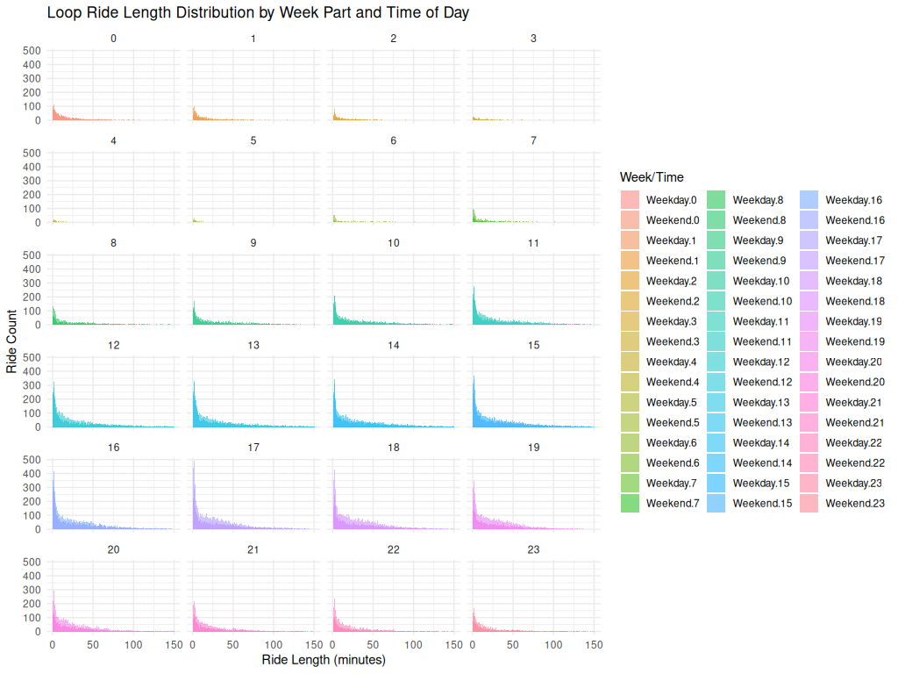

## Loop Ride Length Distribution by Week Part and Time of Day

<figure class="float-right">
  <a href="../Non-Tourist_Customer_Loop_Ride_Length_Distribution.png" target="_blank" title="Select image to open full sized chart">
  
  </a>
  <figcaption>
  Loop ride durations among non-tourist customers show a consistently skewed distribution, regardless of time of day or whether the ride occurred on a weekday or weekend. Ride length is typically short, with a rapid drop-off in frequency after the first 10–15 minutes across all hourly intervals.
  </figcaption>
</figure>


### 📝 Image Notes

Title: Loop Ride Length Distribution by Week Part and Time of Day
Source: Non-tourist customer rides classified as "loop rides" (start and end at the same station)
X-Axis: Ride Length (minutes)
Y-Axis: Ride Count
Faceting: 24 hourly bins (0–23), each split by weekday/weekend
Color Encoding: Different fill colors for each Week.Part.Hour combination (e.g., Weekend.0, Weekday.14) shown in the legend

### Key Observations

    Consistent Right Skew: In every hourly panel, ride length distributions are heavily skewed right, peaking in the 0–10 minute range and tapering off sharply.

    No Strong Time-of-Day Effect: There is no significant shift in distribution shape across hours, though some hour blocks (e.g., mid-afternoon) show more total rides.

    Loop Behavior: This pattern reinforces the idea that many loop rides — likely recreational — are short and time-insensitive.

    Weekend vs. Weekday: Although both categories are shown, the duration distributions remain similar, suggesting time of day may be less influential for loop ride length than ride purpose or rider type.


```R
ggplot(loop_rides_non_tourist, aes(x = ride_length_min, fill = interaction(week_part, hour_local))) 
+
geom_histogram(binwidth = 1, position = "identity", alpha = 0.5) +
facet_wrap(~ hour_local, ncol = 4) +
labs(title = "Loop Ride Length Distribution by Week Part and Time of Day",
x = "Ride Length (minutes)",
y = "Ride Count",
fill = "Week/Time") +
theme_minimal()
```

