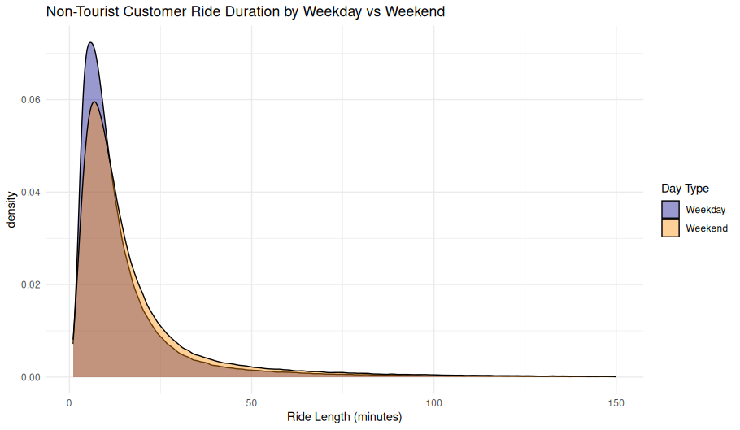

## Ride Duration Distribution by Weekday vs Weekend (Non-Tourist Customers)

<figure class="float-right">
  <a href="../Non-Tourist_Customer_Ride_Duration_by_Weekday_vs_Weekend.png" target="_blank" title="Select image to open full sized chart">
    
  </a>
  <figcaption>
    Ride Duration Distribution by Day Type (Customer Rides Only)<br>
    This density plot shows the distribution of ride durations in minutes for non-tourist customer rides, separated by weekdays and weekends. Weekday rides tend to peak slightly earlier and higher than weekend rides, indicating a stronger presence of short utility trips during the work week.
  </figcaption>
</figure>

### Overview

This kernel density plot compares the **ride duration (in minutes)** of non-tourist customer bike rides, distinguishing between **weekday** and **weekend** behavior. It focuses exclusively on **non-subscriber** riders whose trips did **not** start or end near tourist destinations.

### Axes

- **X-Axis (Ride Length in Minutes)**:
  - Ranges from 0 to 150 minutes.
  - Measures the total ride time as reported in the dataset.
  - Focuses on the practical duration range; longer trips beyond 150 minutes were likely excluded or negligible.

- **Y-Axis (Density)**:
  - Represents the smoothed distribution of ride durations using kernel density estimation.
  - Higher values reflect more common durations.

### Day Type Colors

- **Weekday (Blue)**:
  - Strong peak at short durations (approximately 6–8 minutes).
  - Steeper decline after peak.

- **Weekend (Orange)**:
  - Peak is broader and slightly lower, centered just after 8 minutes.
  - Slower decline, suggesting more variety in weekend usage.

### Observations

- **Weekday rides** are slightly shorter on average and more tightly concentrated.
  - Likely dominated by quick errands, commutes, or first-mile/last-mile transport.
  
- **Weekend rides** show greater variability.
  - Suggests a mix of errand and recreational uses, especially among customers who may be exploring neighborhoods or casually traveling.

- Both distributions are **right-skewed**, with long tails indicating occasional extended rides by some users.

### Behavioral Insight

This view supports the hypothesis that **weekday** customer rides are more **task-oriented**, while **weekend** usage involves **longer, discretionary** trips. Although the differences are subtle, they are consistent with other indicators of time-based travel patterns in non-tourist areas.

### Use Case

This chart is useful for:
- Understanding ride duration norms by day type.
- Supporting demand modeling and pricing strategies tailored to weekdays vs weekends.
- Refining customer journey segmentation without needing user-level metadata.


```R
ggplot(non_tourist_customer_rides_df, aes(x = ride_length_min, fill = week_part)) +
     geom_density(alpha = 0.4) +
     scale_fill_manual(values = c("Weekday" = "darkblue", "Weekend" = "darkorange")) +
     labs(
         title = "Non-Tourist Customer Ride Duration by Weekday vs Weekend",
         x = "Ride Length (minutes)",
         fill = "Day Type"
     ) +
     theme_minimal()
```
