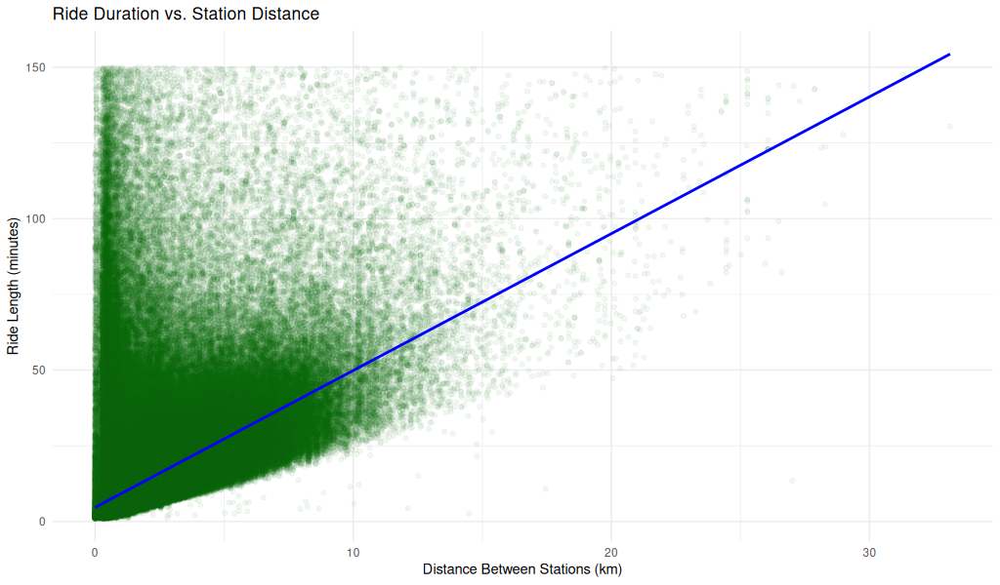

## Ride Duration vs. Station Distance (Non-Tourist Customers)

<figure class="float-right">
  <a href="../Non-Tourist_Customer_Ride_Duration_vs_Station_Distance.png" target="_blank" title="Select image to open full sized chart">
  
  </a>
  <figcaption>
  **Ride Duration vs. Station Distance (Non-Tourist Customer Rides)**
This scatterplot displays the relationship between ride length and distance between stations. While longer distances generally correspond to longer durations, many short-distance rides also exhibit long durations, suggesting varied usage patterns. A linear reference line highlights the lower boundary of likely direct trips.
  </figcaption>
</figure>

### Overview
This scatterplot shows the relationship between **ride duration** and **station-to-station distance** for non-tourist customer rides. A linear reference line is included for interpretive comparison.

### Axes

- **X-Axis (Distance Between Stations in km)**:
  - Ranges from 0 to ~30 km.
  - Represents the straight-line distance between the ride's start and end stations.

- **Y-Axis (Ride Length in minutes)**:
  - Ranges from 0 to 150 minutes.
  - Indicates the duration of each ride.

### Visual Elements

- **Green points**:
  - Represent individual non-tourist customer rides.
  - Heavily concentrated in the lower-left region, tapering as distance increases.

- **Blue line**:
  - A linear reference line (possibly showing a constant-speed model or fitted trend).
  - Helps visualize the general relationship between time and distance.

### Observations

- **Dense cluster near origin**:
  - The majority of rides are short in both duration and distance.
  - Suggests highly localized use, likely for errands or short commutes.

- **Wide variance in ride length for short distances**:
  - Some very short-distance rides take a long time — could indicate indirect routes, traffic, or leisurely pacing.

- **Sparse long-distance rides**:
  - As station distance increases, rides become less frequent but follow a wider spread of durations.

- **Linear boundary below the point cloud**:
  - The blue line roughly follows the **lower edge** of the ride cloud, suggesting a speed floor (minimum speed threshold).
  - This could represent the fastest direct rides, possibly made with electric bikes or scooters.

### Interpretation

- There's a **positive relationship** between station distance and ride duration, but with **high variance**.
- Many long-duration rides cover only short distances, hinting at circuitous routes, heavy traffic, or recreational usage.
- The plot may also reflect the **impact of stop time** (e.g., errands, pauses) not being filtered out.

### Use Case

This visualization helps:
- Explore efficiency and routing behavior of customers.
- Identify outliers and usage extremes (e.g., long duration for short distances).
- Evaluate suitability of distance as a proxy for estimating ride time.

```R
non_loop_rides_df <- non_tourist_customer_rides_df %>%
filter(start_station_id != end_station_id)
library(geosphere)  # for distHaversine
non_loop_rides_df <- non_loop_rides_df %>%
left_join(non_tourist_stations_df %>% select(start_station_id = station_id, start_lat = latitude, st
art_lon = longitude),
by = "start_station_id") %>%
left_join(non_tourist_stations_df %>% select(end_station_id = station_id, end_lat = latitude, end_lo
n = longitude),
by = "end_station_id") %>%
mutate(
distance_m = distHaversine(matrix(c(start_lon, start_lat), ncol = 2),
matrix(c(end_lon, end_lat), ncol = 2)),
distance_km = distance_m / 1000
)


non_loop_rides_df <- non_loop_rides_df %>%
left_join(stations_df %>%
rename(start_station_id = station_id,
start_lat = lat,
start_long = long),
by = "start_station_id") %>%
left_join(stations_df %>%
rename(end_station_id = station_id,
end_lat = lat,
end_long = long),
by = "end_station_id")
non_loop_rides_df <- non_loop_rides_df %>%
mutate(
distance_m = distHaversine(
matrix(c(start_long, start_lat), ncol = 2),
matrix(c(end_long, end_lat), ncol = 2)
),
distance_km = distance_m / 1000
)
'''


'''R
library(ggplot2)
ggplot(non_loop_rides_df, aes(x = distance_km, y = ride_length_min)) +
geom_point(alpha = 0.05, color = "darkgreen") +
geom_smooth(method = "lm", se = FALSE, color = "blue") +
labs(
title = "Ride Duration vs. Station Distance",
x = "Distance Between Stations (km)",
y = "Ride Length (minutes)"
) +
theme_minimal()
```
