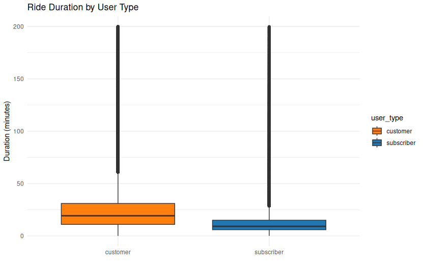

## Ride Duration by User Type ( box plot )

<figure class="float-right">
  <a href="../Ride_Duration_by_User_Type_box.png" target="_blank" title="Select image to open full sized chart">
  
  </a>
  <figcaption>
  FIGCAPTION
  </figcaption>
</figure>


```R
# Connect to the SQLite database
con <- dbConnect(RSQLite::SQLite(), "caseStudy.db")

# Pull ride durations for valid subscriber/customer rides under 60 min
ride_durations <- dbGetQuery(con, "
  SELECT
    CASE user_type
      WHEN 0 THEN 'subscriber'
      WHEN 1 THEN 'customer'
    END AS user_type,
    (end_time - start_time) / 60.0 AS duration_min
  FROM rides
  WHERE user_type IN (0, 1)
    AND end_time > start_time
    AND (end_time - start_time) < 12000
")

# Disconnect
 dbDisconnect(con)
```


```R
ggplot(ride_durations, aes(x = user_type, y = duration_min, fill = user_type)) +
     geom_boxplot(outlier.alpha = 0.1) +
     labs(title = "Ride Duration by User Type", x = "", y = "Duration (minutes)") +
     scale_fill_manual(values = c("subscriber" = "#1f77b4", "customer" = "#ff7f0e")) +
     theme_minimal()
```
