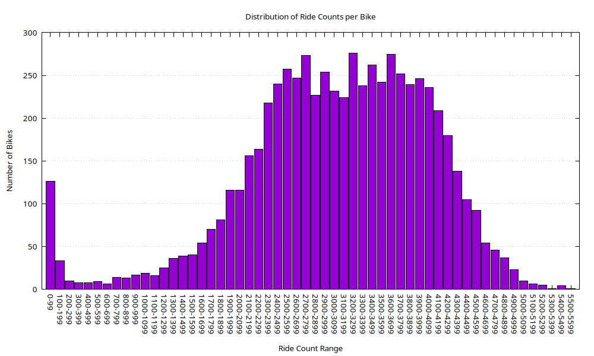

## Distribution of Ride Counts per Bike

<figure class="float-right">
  <a href="../bike_ride_bucket_histogram.png" target="_blank" title="Select image to open full sized chart">
  
  </a>
  <figcaption>
  FIGCAPTION
  </figcaption>
</figure>

### Overview
This histogram visualizes the distribution of **total ride counts per bike**, grouped into buckets of 100 rides each. It provides insight into how evenly or unevenly individual bikes are used over the dataset's timespan.

### Axes

- **X-Axis (Ride Count Range)**:
  - Labeled in bins of 100 rides (e.g., `0-99`, `100-199`, ..., `5500-5599`).
  - Represents the total number of rides associated with each bike.

- **Y-Axis (Number of Bikes)**:
  - Indicates how many bikes fall within each ride count range.
  - Peaks near 300 bikes in the most frequently occurring bins.

### Visual Elements

- **Bars**:
  - Colored purple with black borders.
  - Uniform width, covering each 100-ride range.
  - Distribution forms a roughly symmetric bell-shaped curve centered around the `2700–3499` range.

### Observations

- **Low-end Outliers**:
  - A noticeable spike in the `0–99` bin (~130 bikes), suggesting a set of bikes with extremely limited or no use.
  - May include stolen, damaged, or new bikes added near the end of the data collection period.

- **Core Distribution**:
  - The majority of bikes (~200–280 per bin) fall between `2200–3999` rides.
  - Indicates typical usage patterns and operational consistency.

- **High-end Tail**:
  - Usage drops off steadily after ~4000 rides per bike.
  - Very few bikes exceed 5000 rides.

### Interpretation

- The chart implies a relatively well-utilized fleet with a **normal distribution** centered around ~3000 rides per bike.
- The left-side spike at `0–99` highlights potential outliers worth investigating:
  - Underused bikes,
  - Possible malfunctions,
  - Seasonal deployments,
  - Recent fleet additions.

- The right tail shows some high-mileage bikes that may be candidates for maintenance or replacement soon.

### Use Case

This visualization is valuable for:
- **Fleet maintenance planning** (identify overused/underused bikes),
- **Lifecycle analysis** (detect uneven distribution of wear),
- **Deployment strategy** (optimize rotation or redistribution).

```SQL
.headers on
.mode csv
.output bike_ride_buckets.csv
WITH bucketed AS (
  SELECT
    (ride_count / 100) * 100 AS bucket_start,
    COUNT(*) AS bike_count
  FROM (
    SELECT bike_id, COUNT(*) AS ride_count
    FROM rides
    WHERE bike_id IS NOT NULL
    GROUP BY bike_id
  )
  GROUP BY bucket_start
  ORDER BY bucket_start
)
SELECT
  bucket_start,
  bucket_start + 99 AS bucket_end,
  bike_count
FROM bucketed;
.output stdout
```

```gnuplot
set datafile separator ","
set terminal pngcairo size 1000,600 enhanced font 'Verdana,10'
set output 'bike_ride_bucket_histogram.png'

set title "Distribution of Ride Counts per Bike"
set xlabel "Ride Count Range"
set ylabel "Number of Bikes"
set style fill solid 1.0 border -1
set boxwidth 0.9
set grid ytics
unset key
set xtics rotate by -45

# Format x-tics with the bucket label, like "0–99"
plot 'bike_ride_buckets.csv' using ($0):3:xtic(strcol(1)."-".strcol(2)) with boxes
```

