> 🚧 This case study is currently under construction.
> Please check back soon for a complete walk-through, analysis, and visualizations.

## Business Task

How do [Customers](glossary.qmd#glossary-customer) riders and [Subscribers](glossary.qmd#glossary-subscriber) use bikes differently, and how can that inform marketing strategies?

### Key Questions

-  Which stations have the highest potential to convert Customer riders into Subscribers?
-  What rider behaviors and patterns can we leverage for targeted campaigns?
-  How can data collection be improved to enhance marketing and operational strategies?
-  How does weather effect Subscribers and Customers differently?

### Stakeholders

-  Marketing team
-  Executive leadership
-  Operations team
-  Product development team

---

## Summary of Data Sources

For full data acquisition and cleaning details, see the [Data Sources](data.qmd) documentation and [Provenance](data/provenance.qmd).

The analysis is based on the following datasets:

• **Divvy Bike Trip Data** (2013–2025)[^covid] : This dataset includes anonymized ride-level data from Chicago’s Divvy bike sharing system. The bulk of the data (June 2013 through Sep 2019) (Divvy_Trips_20250501.csv) was obtained from the City of Chicago Data Portal.  The rest (Oct 2019 through Jan 23 2020 and Jun 2023 – April 30 225) was downloaded from Divvy’s S3 archive .  Please note, rides from the time period of the COVID-19 Pandemic are not included.
- **Divvy Bike Station Data**: [City of Chicago Data Portal](https://data.cityofchicago.org/Transportation/Divvy-Bicycle-Stations/bbyy-e7gq/data_preview)
• **Chicago Weather Data** (Hourly): Hourly weather data for Midway International Airport (station ID: 72534) was downloaded from the Metostat bulk archive. The dataset includes temperature, wind speed, precipitation, and other key weather indicators for correlation with bike usage patterns.
• **Tourist Attractions Dataset**{#tourist-attractions} (Custom): A manually curated dataset of key tourist attractions in Chicago (e.g., Navy Pier, Millennium Park, Lincoln Park Zoo, ...) was created to identify rides likely associated with tourism. Latitude and longitude coordinates were obtained using Google Maps for educational use and spatial filtering.

### Attribution
• City of Chicago. (2025). Divvy Trips Datasets. https://data.cityofchicago.org/Transportation/Divvy-Trips/fg6s-gzvg/about_data 
• Lyft. (2025). Divvy Trip Data Archive. https://divvy-tripdata.s3.amazonaws.com/index.html
• Meteostat (https://meteostat.net). (2025). Hourly Weather Data – Midway Airport (72534). https://bulk.meteostat.net/v2/hourly/72534.csv.gz  Provided under the terms of the Creative Commons Attribution-NonCommercial 4.0 International Public License (CC BY-NC 4.0)
• Tourist location coordinates obtained via Google Maps (maps.google.com) for educational and analytical purposes.

### Data Limitations and Biases

The following limitations should be considered when interpreting the results of this analysis.

#### Lack of Individual Rider Tracking

The available data does not include unique rider identifiers. As a result, all analyses are conducted at the trip level, rather than the rider level. This limitation affects the ability to develop insights in several important areas:

##### Frequency and Recency Analysis
- Understanding how often individual riders use the service (e.g., daily, weekly, sporadically).
- Tracking changes in usage frequency across seasons or years.
- Identifying patterns that precede churn (cessation of riding).

##### Rider Lifecycle Modeling
- Measuring time between rides.
- Observing transitions, such as casual weekend riders becoming regular commuters.

##### Retention and Cohort Analysis
- Estimating how long riders stay active after their first trip.
- Comparing retention curves across membership types or initial usage patterns.

##### Ride Type Segmentation
- Detecting mixed behaviors (e.g., riders who both commute and recreate).
- Clustering users based on temporal riding patterns (weekday rush hour vs. weekend recreation).
- Tracking how these patterns evolve over time.

##### Pricing and Subscription Impact
- Assessing how fare changes influence riding frequency for individual users.
- Determining who upgrades or downgrades memberships.
- Evaluating the effectiveness of promotions and loyalty programs on long-term engagement.

##### Equity and Demographics
- Analyzing usage patterns by demographic factors (e.g., age, gender, income, neighborhood) if such attributes were linked to identity.
- Identifying disparities in access and usage among different populations.
- Supporting outreach efforts to underrepresented groups.

##### Safety and Risk Profiling
- Monitoring riders involved in repeat incidents or crashes.
- Correlating individual riding styles (e.g., speed, trip length) with safety outcomes.
- Designing targeted interventions for higher-risk riders.

##### Churn Prediction and Proactive Retention
- Building predictive models to identify riders at risk of discontinuing usage.
- Triggering proactive retention efforts before churn occurs.
- Quantifying how external factors (weather, pricing, station closures) affect rider disengagement.

Access to individual-level identifiers, even in pseudonymized form, would enable a more comprehensive understanding of rider behavior, retention, equity, and safety over time.

##### Timestamp Precision Transition

Rides recorded prior to 2018 include timestamps stored only with minute-level precision. As a result, calculated ride durations for these records are always multiples of 60 seconds. Rides from 2018 onward include full second-level precision, enabling more accurate duration measurement. This change introduces visible clustering of durations in earlier years (e.g., peak on exact minutes), which should be considered when interpreting duration-based distributions and summary statistics.

The following limitations and potential biases should be considered:

- **Temporal Coverage:** Some months or years of data may be incomplete or missing, potentially affecting trend analysis.
- **Data Entry Errors:** Despite cleaning, residual anomalies (e.g., overlapping trips, extreme durations) may remain.
- **Seasonality Bias:** The dataset reflects strong seasonal usage patterns. Results may not generalize to other times of year.
- **Spatial Resolution:** Station coordinates are approximate and do not capture micro-location context. Additionally, the dataset only records the start and end stations for each trip; the actual route taken by the rider is unknown. As a result, any distance calculations, routing assumptions, or exposure to specific infrastructure are approximate.
- **No Non-Ride Data:** There is no information on attempted but unsuccessful rentals, limiting demand analysis.
- **Ride Purpose Inference:** All trip purposes must be inferred.
- **Provider Processing:** Source data may have been pre-processed before publication, with unknown filtering or adjustments.
- **Survivorship Bias:** Only active stations and bikes are represented in the timeframe analyzed.

#### Analyst Context and Interpretive Limitations

  -  Geographic Familiarity:
    The analyst is not a resident of Chicago and has limited firsthand experience with local commuting patterns or neighborhood-level socioeconomic contexts. As a result, station-level inferences about commuter hubs, tourist destinations, or equity considerations are based solely on public data sources and may omit important local nuances.

  -  Bike Share Domain Experience:
    The analyst has not personally used bike share systems. Interpretations of riding patterns, motivations, and user behaviors are derived from publicly available literature and comparable case studies, rather than firsthand experience.

  -  Time and Scope Constraints:
    This analysis was conducted within a limited timeframe and scope. Certain exploratory directions (e.g., deeper weather modeling, granular station clustering) were deferred for potential future work.

  -  Tool Familiarity:
    While the analyst is proficient in data cleaning, analysis, and visualization tools, some analyses could have benefited from specialized GIS or statistical modeling software to enhance spatial and temporal pattern detection.

---

## Assumptions

#### Time and Date Assumptions

 -  All timestamps are stored and processed in UTC unless explicitly converted.
 -  Rides with durations exceeding 24 hours are assumed to be errors or unreturned bikes and are excluded from duration analyses.
 -  Missing timezone metadata in the source files is assumed to default to UTC, consistent with Divvy’s historical exports.

#### Data Completeness Assumptions

 -  The Divvy Trip data is assumed to be a complete record of rides within the date range specified.
 -  Gaps in data for certain months (e.g., missing or partial files) are assumed to be either unavailable or intentionally omitted by the provider (data from the time of the COVID-19 pandemic is a good example of this).
 
#### User Classification Assumptions

  -  Rides labeled as "[Subscriber](glossary.qmd#glossary-subscriber)" or "[member](glossary.qmd#glossary-member)" or are assumed to represent members with recurring plans.
  -  Rides labeled as "[Customer](glossary.qmd#glossary-customer)" or "[casual](glossary.qmd#glossary-casual-user)" are assumed to represent casual, pay-per-use riders.
  -  Null or unknown user types are excluded from ingestion as part of the main question this study seeks to answer is "How do [Customers](glossary.qmd#glossary-customer;) riders and [Subscribers](glossary.qmd#glossary-subscriber) use bikes differently".
  
#### Station Data Assumptions

 -   Stations with duplicate names but sufficiently distinct coordinates are assumed to be separate installations (e.g., multiple docks at the same intersection).
 -   When a station name conflicts across datasets, the most recent dataset is assumed to be authoritative.
 -   Station locations (lat/long) are assumed accurate to within ~20 meters, recognizing older records had lower precision.  

#### Weather Data Assumptions

 -  Weather conditions from Midway Airport are assumed to be broadly representative of the downtown Chicago area.
 -  Missing weather observations for isolated hours are assumed not to materially affect aggregate trends.
 
#### Behavioral Assumptions

 -  All rides are assumed to represent legitimate use, except for explicitly excluded outliers (e.g., zero-duration rides, overlapping rides).
 -  Rides during the pandemic period are assumed to reflect atypical behavior and are excluded where appropriate to avoid skewing trends.
 -  Stations with >90% Subscriber rides are commuter-focused hubs.
 -  Stations with high Customer usage but low Subscribers are likely tourist-oriented.
 -  Midday rides often represent “Lunch & Ride” exercise trips.

#### Modeling and Analysis Assumptions

 -  Temporal aggregation (e.g., hourly or daily binning) does not introduce significant bias in patterns observed.
 -  The choice of thresholds (e.g., 24-hour ride duration, maximum acceptable duplicates) reflects domain-reasonable cutoffs and does not materially distort the dataset.

---

## Validations

To ensure data quality and analytical reliability, the following validations were performed:

- **Schema Consistency Checks:** Verified that all data files conformed to the expected schema, accounting for changes in column names, data types, and field definitions over time.
- **Record Integrity:** Identified and removed duplicate ride records and inconsistent bike usage records (e.g., overlapping rides for the same bike, etc).
- **Time Validity:** Dropped rides with invalid or implausible timestamps (e.g., start times after end times, rides exceeding 24 hours).
- **User Type Validation:** Removed records with null or unrecognized user type labels to maintain clarity in Subscriber vs. Customer analyses.
- **Station Data Reconciliation:** Addressed variations and duplicates in station naming and coordinates, resolving conflicts where stations had inconsistent IDs or locations.
- **Weather Data Quality:** Reviewed weather data and dropped weather data from times before the study time period, for the few missing values decided not to impute values but rather leave them NULL.
- **Referential Integrity:** Enforced that all station IDs referenced in the rides table had corresponding records in the stations table at time of ingestion.

Further technical detail, including code and step-by-step operations, is documented in the [data sources](data.qmd) and [Provenance](data/provenance.qmd). Excruciating details may also be found in the [Work Log](workLog.md).

---

## Key Metrics and Analysis

All figures referenced here are compiled in the [Visualization Compendium](viz/visualizations.qmd).

### Summary Statistics and Insights

#### Data Overview

Before focusing on Subscriber and Customer behavior differences, this section summarizes the overall dataset characteristics. This report utilized data stretching from , covering some 28,386,565 rides, 1,276 stations and 103,811 hourly weather readings. The SQLite database file size (all tables) is over 1.7 GB.  

**Rides Data**

The rides dataset serves as the central resource for this analysis. It captures individual bike trips recorded by the Divvy bike share system over a multi-year span. Each record corresponds to a single ride, including attributes such as the start and end timestamps, the originating and destination stations, user classification (Subscriber or Customer), and additional metadata related to the trip.

In total, the dataset contains more than 28 million records covering trips from June 2013 up to May 2025. This scale allows for robust analysis of seasonal, temporal, and spatial patterns in usage. However, the dataset does not include personally identifiable information or unique rider identifiers. As a result, the analysis is focused on aggregate behaviors rather than individual-level tracking or retention modeling.

Throughout this report, the rides dataset is used to derive key performance metrics, explore relationships between usage and weather, and identify trends in demand and fleet utilization. It also serves as the basis for spatial and temporal visualizations of system activity.

For readers interested in detailed summary statistics, such as date ranges, record counts, and other descriptive metrics, please expand the table below.

::: {.callout-note collapse="true"}
##### Rides Dataset Overview Table

| Metric                           | Value               |
| -------------------------------- | ------------------- |
| Total rides analyzed             | 28,386,565          |
| Time period covered              | Thursday June 27th 01:06:00 AM CDT 2013 to Wednesday April 30th 11:59:40 PM CDT 2025|
| Average ride duration            | 16.9 minutes        |
| Median ride duration             | 11.0 minutes        |
| Mode ride duration[^precision]   |  6.0 minutes        |
|Number of Unique Start Stations   | 1245     |
|Number of Unique End Stations	   | 1216     |
|Average Ride Distance             | 2.13 km  |
|Longest Ride Distance[^real]      | 36.82 km  |
|Distribution of User Types[^round]|Subscriber: 20,519,211 (72%) Customer: 7,867,354 (28%)|
|Peak Month	        | August|
|Off-Peak Month 	| January|
|Number of Records with Missing Data| 0|
|Timestamp Precision	        | Minute precision through 2017 Second precision starting in 2018|
|Proportion of One-Way Rides	| 95%|
| [Peak Concurrency](glossary.qmd#glossary-peak-concurrency)| 1178 rides |
:::
**Stations Data**

The stations dataset contains detailed information about the physical locations within the Divvy bike share system where trips begin and end. Each record represents a station, including attributes such as the station name, geographic coordinates (latitude and longitude), and where available capacity (number of [docks](glossary.qmd#glossary-docks)), and installation dates.

This dataset covers over 1200 unique stations spanning the full operational area, with data reflecting changes over time including station additions, removals, and capacity adjustments. The stations dataset plays a crucial role in spatial analysis, enabling assessment of geographic coverage, station popularity, and infrastructure utilization.

While comprehensive, the dataset may include some stations that were temporarily inactive, removed, or never opened and not all stations have complete metadata for every attribute. These limitations are considered in the analysis to ensure accuracy and context.

For readers interested in detailed station-level statistics, such as counts, capacity distributions, and geographic summaries, please expand the table below.

:::{.callout-note collapse="true"}
##### Stations Dataset Overview Table

| Metric                                | Value                 |
|---------------------------------------|-----------------------|
|Number of stations                    | 1,266               |
|Maximum Distance between stations     | 48.42 KM            |
|Most Common Start Station	| Streeter Dr & Grand Ave 392,422 Departures|
|Least Common Start Stations    | 4 stations with 1 departure each[^tied]|
|Never Used as Start Station    | 21 stations with 0 departures|
|Most Common End Station        | Streeter Dr & Grand Ave 430,195 Arrivals|
|Least Common End Stations      | 14 stations tied with 1 arrival each[^least]| 
|Never Used as End Station      | 50 stations with 0 arrivals|
|Number of Inactive Stations	| 20 Stations with no departures or arrivals|
|Average Capacity (Docks)	| 16.5|
|Median Capacity (Docks)        | 15.0|
|Minimum Capacity[^tiny] (Docks)| 1|
|Maximum Capacity[^max] (Docks) | 400|
|Number of Stations Near Tourist Areas[^tourist]| 354 (30%)|
|Records with missing coordinates | 0                   |

:::

### Trends and Patterns

#### Temporal Patterns

##### Key Visualizations

<figure class="float-right" id="fig9">
  <a href="viz/visualizations.qmd#fig9" target="_blank" title="Select image to see in the Visualizations Compendium">
  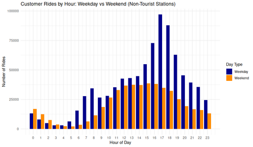
  </a>
  <figcaption>
   Figure 9: Hourly comparison of **[Customer](glossary.qmd#glossary-customer)** rides by day type (weekday vs weekend) at non-tourist stations, 
  </figcaption>
</figure>

- **Customer Rides by Hour: Weekday vs Weekend (Non-Tourist Stations)**
  A Grouped bar chart comparing hourly Customer rides on weekdays and weekends at non-tourist stations, highlighting differences in temporal riding behavior.
  - [View entry »](viz/Non-Tourist_Customer_Rides_by_Hour_Weekday_vs_Weekend.md){target="_blank"}
  - [Full-size image »](images/Non-Tourist_Customer_Rides_by_Hour_Weekday_vs_Weekend.png){target="_blank"}
  

 

<figure class="float-right" id="fig6">
  <a href="viz/visualizations.qmd#fig6" target="_blank" title="Select image to see in the Visualizations Compendium">
  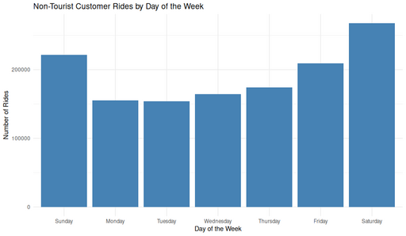
  </a>
  <figcaption>
  Figure 6: Total **[Customer](glossary.qmd#glossary-customer)** rides per day of week at non-tourist stations
  </figcaption>
</figure>

- **Non-Tourist Customer Rides by Day of the Week**
  A Bar chart showing Customer ride counts by day of the week at non-tourist stations, highlighting the clear weekend peaks in ridership.
  - [View entry »](viz/Non-Tourist_Customer_Rides_by_Day_of_the_Week.md){target="_blank"}
  - [Full-size image »](images/Non-Tourist_Customer_Rides_by_Day_of_the_Week.png){target="_blank"}    

 

<figure class="float-right" id="fig10">
  <a href="viz/visualizations.qmd#fig10" target="_blank" title="Select image to see in the Visualizations Compendium">
  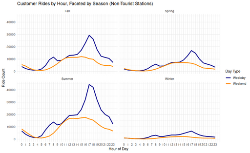
  </a>
  <figcaption>
  Figure 10: Hourly Customer ride patterns by season at non-tourist stations.
  </figcaption>
</figure>

- **Customer Rides by Hour, Faceted by Season (Non-Tourist Stations)**
  A Line chart showing hourly Customer ride volumes at non-tourist stations showing weekday rides peak strongly in the late afternoon during warmer seasons, while weekend rides are more evenly distributed. Winter shows the lowest activity overall.
  - [View entry »](viz/Non-Tourist_Customer_Ride_by_Hour_Faceted_by_Season.md){target="_blank"}
  - [Full-size image »](images/Non-Tourist_Customer_Ride_by_Hour_Faceted_by_Season.png){target="_blank"}  
  

 

<figure class="float-right" id="fig12">
  <a href="viz/visualizations.qmd#fig12" target="_blank" title="Select image to see in the Visualizations Compendium">
  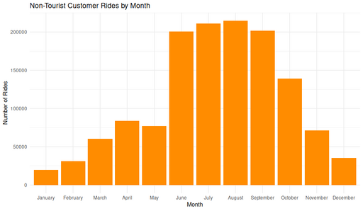
  </a>
  <figcaption>
  Figure 12: Monthly distribution of [Customer](glossary.qmd#glossary-Cusomer) rides at non-tourist stations.
  </figcaption>
</figure>

- **Non-Tourist Customer Rides by Month**
  A Bar chart showing the number of Customer rides per month at non-tourist stations, illustrating clear seasonality in usage patterns.
  - [View entry »](viz/Non-Tourist_Customer_Rides_by_Month.md){target="_blank"}
  - [Full-size image »](images/Non-Tourist_Customer_Rides_by_Month.png){target="_blank"}  

 

##### Observations

**Hourly Patterns**:
Ride activity is minimal between midnight and 5 AM. Rides increase through the morning, reach a plateau from noon to mid-afternoon, and peak sharply around 5 PM. Evening usage gradually declines but remains non-negligible until 11 PM.

**Weekday vs Weekend**:
Weekdays show clear afternoon peaks (~17:00), typical of post-work commuting. Weekends display a flatter distribution, with more consistent usage from late morning through early afternoon (10:00–16:00).

**Day-of-Week Trends**:
Saturday consistently has the highest ride volume, followed by Sunday. Weekdays maintain a lower but steady ride count.

**Commuter Indicators**:
Non-tourist station usage on weekdays shows strong morning (7–9 AM) and evening (16–18 PM) peaks, suggesting routine commuting behavior even among Customers.

**Seasonal Variations**:
Summer has the highest usage by far, with August as the peak month. Winter sees a dramatic reduction in activity and flatter hourly distributions. Spring and Fall show intermediate patterns, with clear late afternoon weekday peaks but lower volume than summer.

##### Interpretations

**Behavioral Segmentation by Time**:
The weekday 5 PM peak aligns with traditional commuting patterns, while the more even midday usage on weekends points to discretionary or leisure-based riding.

**Role of Weather and Season**:
Warmer months not only increase total rides but also amplify commute-style weekday peaks. Cold weather in winter dampens all usage but doesn't eliminate it, which implies that a baseline group of Customers persists year-round.

**Spatial Behavior Confirmation**:
Excluding tourist stations strengthens the argument that these patterns reflect local Customer use, not tourist behavior. Even among non-Subscribers, there is strong evidence of routine and purposeful riding patterns.

**Operational Implications**:
These temporal patterns suggest opportunities for optimizing fleet availability, staffing, and maintenance. For instance, summer weekday evenings may require more active bike redistribution, while winter mornings can likely be deprioritized.

##### Summary Trends

Customer ride behavior is strongly time-sensitive, exhibiting weekday commute-like peaks around 5 PM and a consistent weekend midday usage pattern. Seasonality plays a major role, warm months drive higher volumes and sharper commute peaks, while winter flattens and suppresses demand. These patterns, observed even after filtering out tourist stations, confirm that many Customer rides are local and purpose-driven and not purely recreational.

#### Temperature and Weather Effects

##### Key Visualizations

<figure class="float-right" id="fig15">
  <a href="viz/visualizations.qmd#fig15" target="_blank" title="Select image to see in the Visualizations Compendium">
  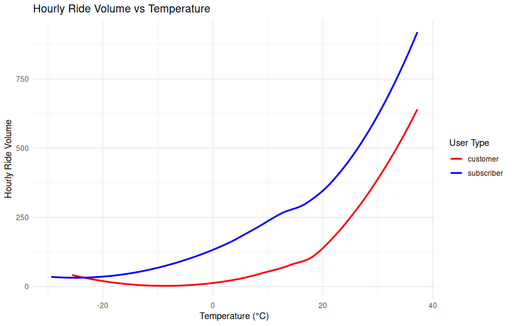
  </a>
  <figcaption>
  Figure 15: Hourly ride volume as a function of temperature, comparing Customers and Subscribers. 
  </figcaption>
</figure>

- **Hourly Ride Volume vs Temperature**
  [LOESS](glossary.qmd#glossary-LOESS)-smoothed Line chart showing hourly ride volume by temperature in Celsius. Patterns remain elevated at higher temperatures due to the smoothing method.  
  - [View entry »](viz/Hourly_Ride_Volume_vs_Temperature.md){target="_blank"}
  - [Full-size image »](images/Hourly_Ride_Volume_vs_Temperature.png){target="_blank"} 
  

 

<figure class="float-right" id="fig37">
  <a href="viz/visualizations.qmd#37" target="_blank" title="Select image to see in the Visualizations Compendium">
  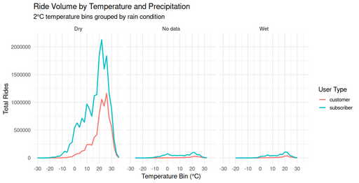
  </a>
  <figcaption>
  Figure 37: This panel chart shows total ride volume  grouped by dry, wet, and unknown precipitation conditions.
  </figcaption>
</figure>

- **Ride Volume by Temperature and Precipitation**
  A Line chart panel showing total ride volume for **[Subscribers](glossary#glossary-subscriber)** and **[customers](glossary#glossary-)**, by temperature bin and precipitation condition (Dry, No data, Wet). Most rides occur in dry weather at temperatures between 20–25°C. Wet conditions significantly suppress ridership for both user types, revealing clear sensitivity to rain.
  - [View entry »](viz/Ride_Volume_by_Temp_and_Precipitation.md){target="_blank"}
  - [Full-size image »](images/Ride_Volume_by_Temp_and_Precipitation.png){target="_blank"}
  

 

<figure class="float-right" id="fig21">
  <a href="viz/visualizations.qmd#fig21" target="_blank" title="Select image to see in the Visualizations Compendium">
    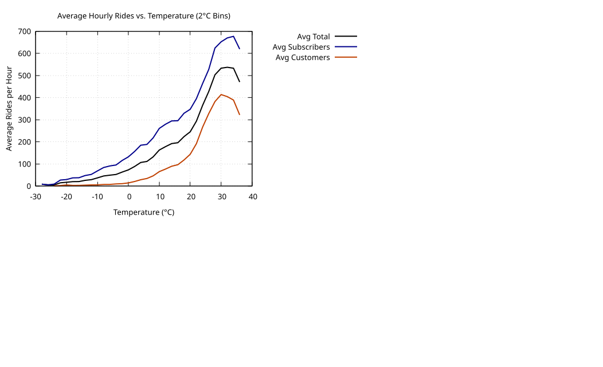
  </a>
  <figcaption>
    Figure 21: Normalized average hourly rides by temperature.
  </figcaption>
</figure>

- **Normalized Average Hourly Rides vs Temperature**
  A Line chart showing normalized average hourly bike rides by temperature (°C), showing Subscriber, Customer, and total ride volume, peaking near 25°C.
  - [View entry »](viz/Normalized_Avg_Hourly_Rides_vs_Temperature.md){target="_blank"}
  - [Full-size image »](images/Avg_Hourly_Rides_vs_Temp.svg){target="_blank"}

 

<figure class="float-right" id="fig14">
  <a href="viz/visualizations.qmd#fig14" target="_blank" title="Select image to see in the Visualizations Compendium">
  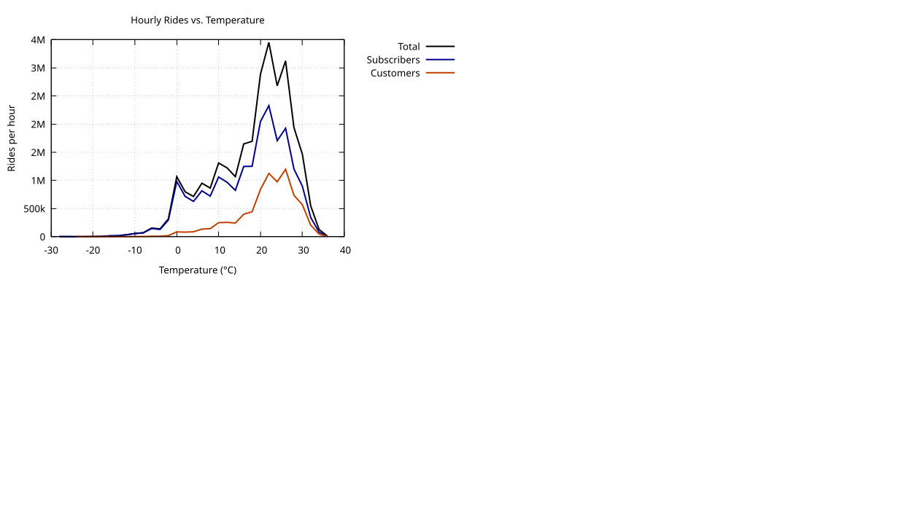
  </a>
  <figcaption>
  Figure 14: Hourly ride counts by 2°C temperature bins. 
  </figcaption>
</figure>

- **Hourly Rides vs. Temperature (2°C bins)**
  A Line chart showing total hourly rides plotted against temperature in 2°C increments, with separate curves for Total, Subscriber, and Customer rides. Warmer temperatures strongly correlate with increased bike usage, especially among Customers.
  - [View entry »](viz/Hourly_Rides_vs_Temp.md){target="_blank"}
  - [Full-size image »](images/Hourly_Rides_vs_Temp.svg){target="_blank"}
  

 

##### Observations

**Temperature-Driven Usage**:
Ride volume increases steadily with temperature, peaking between 24–26°C (75–78°F). Above ~30°C, usage declines, especially for Customers.

**User Type Sensitivity**:
Customers show greater responsiveness to warming temperatures, with steeper usage increases and sharper declines beyond optimal ranges. Subscribers maintain a broader tolerance but still follow a similar bell-shaped usage curve.

**Cold Weather Behavior**:
Sub-zero temperatures (< 0°C) show minimal usage across all groups. Subscribers retain a small baseline of cold-weather activity, unlike Customers whose volume approaches zero.

**Precipitation Effects**:
Rain significantly suppresses ride volume, flattening the temperature-ridership curve and reducing variability between user types. In wet conditions, both Subscribers and Customers show near-identical behavior.

**Data Distribution Limits**:
The dataset is concentrated between 5°C and 25°C, with relatively sparse observations at the temperature extremes. This explains smoother, more consistent curves in the mid-range and volatility at the tails.

**Continuous vs Binned Trends**:
LOESS-based smoothed charts show continuous temperature associations, while binned histograms reveal more visible drop-offs at higher temperatures, especially above 30°C.

##### Interpretations

**Temperature is a Dominant Predictor**:
The consistent bell-shaped curve across all user types confirms that moderate warmth is ideal for biking, especially in the 20–26°C range.

**User Motivation Differentiation**:
Subscriber behavior suggests a commute-driven pattern, with usage clustered in comfortable temperature bands. Customer patterns reflect recreational or discretionary riding, with more dramatic increases in good weather and steeper declines when it’s too hot or cold.

**Rain as a Deterrent**:
Wet conditions override other factors as both Subscribers and Customers dramatically reduce usage, regardless of temperature. This uniform suppression highlights precipitation as a powerful behavioral constraint.

**Operational Implications**

 - **Redistribution and Fleet Scaling**: Summer afternoons and warm, dry days will require greater bike availability. Rainy or cold days may allow for reduced redistribution efforts.
 - **Maintenance Planning**: Off-peak seasons (winter or rainy periods) can support more aggressive fleet maintenance windows.
 - **Targeted Messaging**: Marketing to Customers should align with warm, dry forecast windows. Subscriber incentives might focus on resilience in fringe-weather conditions.

##### Summary Trends

Temperature and precipitation are among the strongest environmental drivers of bike usage. Rides peak in warm, dry weather around 25°C and fall sharply in cold or wet conditions. Customers exhibit greater sensitivity to weather changes, while Subscribers maintain a steadier, commuting-aligned pattern. These trends support adaptive operational planning and weather-aware engagement strategies.

#### Ride Duration and Distance Distributions

##### Key Visualizations

<figure class="float-right" id="fig48">
  <a href="viz/visualizations.qmd#fig48" target="_blank" title="Select image to see in the Visualizations Compendium">
  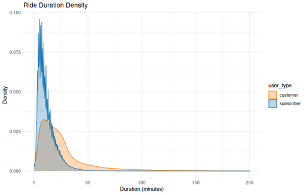
  </a>
  <figcaption>
  Figure 48: Density plot of ride durations by user type. 
  </figcaption>
</figure>

- **Ride Duration Density**
  A Density plot comparing ride durations for Customers and Subscribers. **[Subscribers](glossary.qmd#glossary-subscriber)** tend to take shorter trips, while **[Customers](glossary.qmd#glossary-customer)** have more varied and longer rides.
  - [View entry »](viz/Ride_Duration_Density.md){target="_blank"}
  - [Full-size image »](images/Ride_Duration_Density.png){target="_blank"}
  

 

<figure class="float-right" id="fig23">
  <a href="viz/visualizations.qmd#fig23" target="_blank" title="Select image to see in the Visualizations Compendium">
  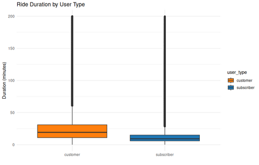
  </a>
  <figcaption>
    Figure 23: Box plot of ride durations by user type.
  </figcaption>
</figure>

- **Ride Duration by User Type ( box plot )**
  A Box plot comparing ride durations for Subscribers and Customers. **[Subscribers](glossary.qmd#glossary-subscriber)** have shorter, more consistent trips, while **[Customers](glossary.qmd#glossary-customer)** exhibit longer and more variable ride times.
  - [View entry »](viz/Ride_Duration_by_User_Type_box.md){target="_blank"}
  - [Full-size image »](images/Ride_Duration_by_User_Type_box.png){target="_blank"}

 

<figure class="float-right" id="fig27">
  <a href="viz/visualizations.qmd#fig27" target="_blank" title="Select image to see in the Visualizations Compendium">
  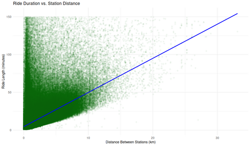
  </a>
  <figcaption>
  Figure 27: This scatterplot displays the relationship between ride length and distance between stations.
  </figcaption>
</figure>

- **Ride Duration vs. Station Distance (Non-Tourist Customers)**
  A "Scatterplot showing ride duration (minutes) versus station-to-station distance (km) for non-tourist Customer rides. While longer distances generally correspond to longer durations, many short-distance rides also exhibit long durations, suggesting varied usage patterns. A linear reference line highlights the lower boundary of likely direct trips.
  - [View entry »](viz/Non-Tourist_Customer_Ride_Duration_vs_Station_Distance.md){target="_blank"}
  - [Full-size image »](images/Non-Tourist_Customer_Ride_Duration_vs_Station_Distance.png){target="_blank"}  

 

<figure class="float-right" id="fig32">
  <a href="viz/visualizations.qmd#fig32" target="_blank" title="Select image to see in the Visualizations Compendium">
  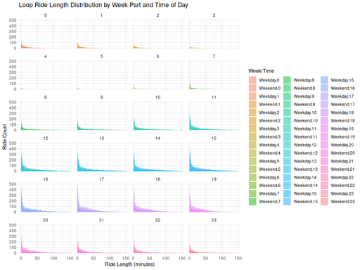
  </a>
  <figcaption>
  Figure 32: Loop ride durations among non-tourist Customers.
  </figcaption>
</figure>

- **Loop Ride Length Distribution by Week Part and Time of Day**
  A grid of histograms showing the distribution of loop ride durations for non-tourist Customers, showing a consistently skewed distribution, regardless of time of day or whether the ride occurred on a weekday or weekend.
- **Loop Ride Length Distribution by Week Part and Time of Day**
  - [View entry »](viz/Non-Tourist_Customer_Loop_Ride_Length_Distribution.md){target="_blank"}
  - [Full-size image »](images/Non-Tourist_Customer_Loop_Ride_Length_Distribution.png){target="_blank"}
  

 

<figure class="float-right" id="fig31">
  <a href="viz/visualizations.qmd#fig31" target="_blank" title="Select image to see in the Visualizations Compendium">
  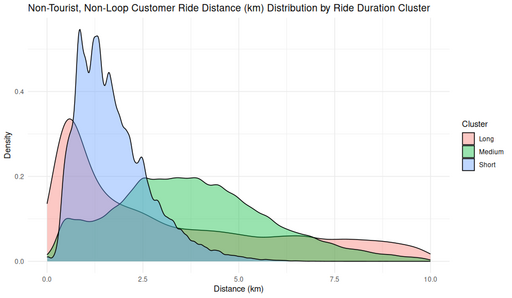
  </a>
  <figcaption>
    Figure 31: This density plot compares ride distances for non-tourist loop Customer rides.
  </figcaption>
</figure>

- **Ride Distance Distribution by Duration Cluster (Non-Tourist, Non-Loop, Customers)**
  A density plot showing the distribution of ride distances in kilometers for [non-loop](glossary.qmd#glossary-non-loop-ride) [Customer](glossary.qmd#glossary-customer) rides, grouped into clusters based on ride duration. Short-duration rides are tightly concentrated around 1–2 km, medium-duration rides cover a broader 2–6 km range, and long-duration rides extend further, reflecting distinct usage behaviors within the same user group.
  - [View entry »](viz/Non-Tourist_Non-Loop_Customer_Ride_Distance_Distribution_by_Ride_Duration_Cluster.md){target="_blank"}
  - [Full-size image »](images/Non-Tourist_Non-Loop_Customer_Ride_Distance_Distribution_by_Ride_Duration_Cluster.png){target="_blank"}  

 

##### Observations

**Duration by User Type**:

  - **Subscribers**: Ride durations peak sharply around 10–15 minutes, with a rapid drop-off beyond 30 minutes.
  - **Customers**: Durations are more broadly distributed, with a long right tail extending beyond 100 minutes.

**Boxplot Distributions**:

  - Subscribers show tight interquartile ranges with few outliers.
  - Customers have higher medians, greater variability, and more long-duration rides.

**Weekday vs Weekend**:

 - Weekday rides are shorter on average (~6–8 minutes), likely task-oriented.
 - Weekend rides are longer (~8–10 minutes), suggesting more recreational or flexible use.

**Loop Rides**:

  - Highly skewed toward very short durations (3–7 minutes), with minimal variance between weekdays and weekends.

**Distance Distribution**:

  - Most rides are under 2 km, with pronounced peaks around 0.85 km and 1.35 km, likely common station-to-station pairs or a common distance between stations.
  - Very few rides exceed 5 km; rides over 20 km are rare outliers.

**Duration vs Distance**:

  - A clear positive correlation exists, but wide variance in duration suggests stops, detours, or casual pacing.
  - A lower-bound line shows plausible “fastest rides,” but many trips exceed expected times for a given distance.

##### Interpretations

**Behavioral Divergence by User Type**:

  - Subscribers show behavior consistent with commuting or short errands. Quick time-sensitive trips likely shaped by pricing incentives (e.g., overage fees after 30 minutes).
  - Customers display patterns more aligned with recreation, exploration, or discretionary travel, evidenced by longer durations and greater variability.

**Temporal Consistency**:

  - Duration distributions are similar across hours and days of the week, suggesting predictable, habitual short-trip behavior among Customers.

**Spatial Boundaries**:

  - Most rides occur within 1–2 km, indicating localized usage e.g., last-mile transit, station-to-station hops, or intra-neighborhood errands.

**Usage Clustering**:

  - The sharp peaks in duration and distance hint at high-volume, frequently traveled routes between key station pairs.
  - The absence of multi-modal distance peaks differentiates these patterns from tourist-heavy datasets, reinforcing the local, utilitarian character of non-Subscriber rides.

**Variability and Edge Cases**:

  - Some rides show long durations but modest distances, implying possible non-transportation use: rest stops, detours, or leisure pacing.
  - A small number of long-distance rides suggest niche use cases (e.g., exercise or destination trips) but are statistically insignificant.
        
#### Spatial Patterns

Analysis of spatial patterns among Customers reveals a highly localized and purpose-driven use of the Divvy system. While tourist hubs are excluded from this dataset, clear usage hotspots still emerge.

**High-Usage Local Hubs**:
The most popular non-tourist stations accumulate ride volumes far exceeding those near the bottom of the top 25. This steep usage drop-off indicates that Customer riders are clustering their activity around a small number of key locations. These likely serve as community nodes near transit stops, commercial corridors, or dense residential zones. Thus highlighting the presence of neighborhood-scale ridership hubs.

**Trip Distance Distribution**:
Ride distance data displays two strong peaks at approximately 0.86 km and 1.29 km, suggesting common use cases like very short errands, intra-neighborhood trips, or first/last-mile connections. A steep decline beyond 4–5 km confirms that long-distance trips are rare, reinforcing the system's use as a hyper-local mobility option for Customers.

**Modal Preferences and Fleet Distribution**:
Customers show more diverse preferences across vehicle types than Subscribers. While electric bikes are popular across both groups, Customers also make significant use of scooters and docked bikes. Two modes that are almost unused by Subscribers. This diversity points to more occasional, exploratory, or convenience-based decisions among Customers.

**Fleet Utilization**:
Fleet usage patterns further reveal operational insights. Most bikes fall within a healthy usage range (2200–3999 rides), suggesting balanced deployment and rotation. However, a noticeable spike in underutilized bikes (0–99 rides) may represent malfunctions, late additions to the fleet, or seasonal imbalances. Conversely, high-mileage bikes (>4000 rides) could signal workhorses nearing maintenance thresholds.

**Summary**:
Together, these spatial trends suggest that Customers engage in short, highly localized trips clustered around urban activity centers. Their flexible vehicle choices and the uneven distribution of ride volumes across the fleet highlight different motivations and constraints compared to Subscribers, such as spontaneity, novelty, or limited commitment.

#### Fleet & Usage Patterns

Analysis of vehicle type and fleet usage data reveals distinct preferences and operational dynamics between Subscribers and Customers.

##### Key Diagrams

<figure class="float-right" id="fig1">
  <a href="viz/visualizations.qmd#fig1" target="_blank" title="Select image to open full sized
 chart">
  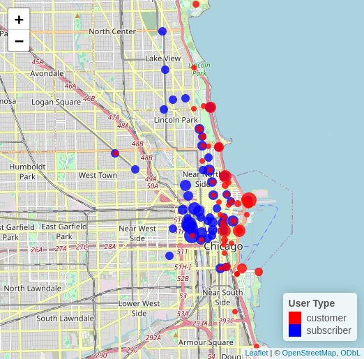
  </a>
  <figcaption>
  Figure 1: Top 50 stations for Subscribers (blue) and Customers (red). 
  </figcaption>
</figure>

- **Top 50 Stations by User Type**
  Interactive map showing the top 50 stations ranked by ride volume for Subscribers (blue) and Customers (red). Dot size is scaled by ride count, and slight offsets prevent overlap at shared stations. This visualization reveals geographic clustering and usage contrasts between user types. Dot size scales with ride count.
  - [View entry »](viz/Top_50_Stations_by_User_Type.md){target="_blank"}
  - [Interactive Map »](Top_50_Stations_by_User_Type.html){target="_blank"}
  

  
  
<figure class="float-right" id="fig35">
  <a href="viz/visualizations.qmd#fig35" target="_blank" title="Select image to see in the Visualizations Compendium">
  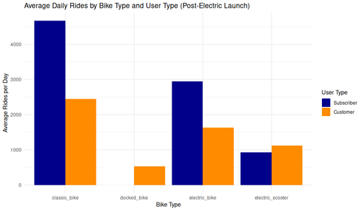
  </a>
  <figcaption>
  Figure 35: Average daily rides by bike type and user type.
  </figcaption>
</figure>

- **Average Daily Rides by Bike Type and User Type (Post-Electric Launch)**
  Bar chart showing average daily rides by bike type and user type, after the introduction of electric bikes and scooters. Classic bikes remain dominant among Subscribers, while electric modes see substantial adoption by both user groups.
  - [View entry »](viz/Avg_Daily_Rides_by_Bike_and_User_Type_post_elec.md){target="_blank"}
  - [Full-size image »](images/Avg_Daily_Rides_by_Bike_and_User_Type_post_elec.png){target="_blank"}

<figure class="float-right" id="fig3">
  <a href="viz/visualizations.qmd#fig3" target="_blank" title="Select image to see in the Visualizations Compendium">
  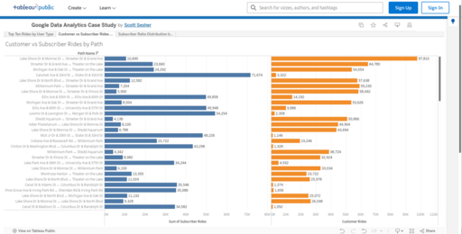
  </a>
  <figcaption>
  Figure 3: Comparison of Customer vs. Subscriber Rides by Path.
  </figcaption>
</figure>

-  **Comparison of Customer vs. Subscriber Rides by Path**
horizontal bar chart visualizes the total number of rides by customer type (subscribers in blue, casual customers in orange) for the top ride paths. It highlights differences in route preferences and ride volumes between the two user segments.
  - [View entry »](viz/Customer_vs_Subscriber_Rides_by_Path.md){target="_blank"}
  - [View on Tableau »](https://public.tableau.com/app/profile/scott.sesher/viz/GoogleDataAnalyticsCaseStudy_17480226880920/Sheet2){target="_blank"}

<figure class="float-right" id="fig36">
  <a href="viz/visualizations.qmd#fig36" target="_blank" title="Select image to see in the Visualizations Compendium">
  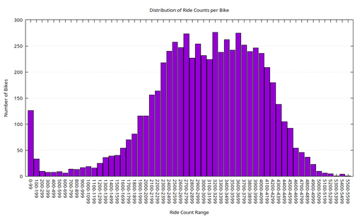
  </a>
  <figcaption>
    Figure 36: Distribution of total ride counts per bike across the fleet.
  </figcaption>
</figure>

- **Distribution of Ride Counts per Bike**
  Histogram showing the distribution of total ride counts per bike, highlighting underused outliers and high-mileage bikes.
  - [View entry »](viz/bike_ride_bucket_histogram.md){target="_blank"}
  - [Full-size image »](images/bike_ride_bucket_histogram.png){target="_blank"}

##### Modal Usage by Rider Type
Classic bikes remain the workhorses of the Divvy system, with Subscribers contributing the bulk of their ride volume. This aligns with commuter-like behavior, regular, utilitarian, and possibly cost-conscious.

Electric bikes show broad appeal across both groups, underscoring their convenience and efficiency. While Subscribers still dominate in total ride volume, Customers account for a substantial portion of electric bike usage, suggesting a growing comfort and interest in this mode.

Docked bikes, in contrast, register very low overall usage and appear to be used exclusively by Customers. This could reflect limited availability or a transitional state in fleet management. The presence of docked bikes among Customers but not Subscribers, may indicate situational or novelty-based usage.

Electric scooters, while contributing fewer total rides than bikes, are notably more popular with Customers than with Subscribers. Their lighter, more spontaneous usage pattern aligns with leisure or last-mile contexts rather than regular commuting.

##### Subscriber vs. Customer Modal Tendencies
Subscribers overwhelmingly prefer classic and electric bikes, reinforcing the notion of predictable, scheduled usage. Customers, by contrast, distribute their usage more evenly across all available vehicle types. Their comparatively higher share of docked bike and scooter usage suggests more casual, opportunistic, or exploratory trip behavior.

The introduction of electric options (bikes and scooters) appears to have encouraged broader participation across both rider groups, potentially siphoning some trips away from classic bikes and shifting the system's overall modal balance.

##### Fleet Utilization Distribution
The distribution of rides per bike exhibits a strong central tendency, with most bikes registering between 2200 and 3999 rides. This suggests a balanced and consistently utilized core fleet.

However, a notable cluster of low-use outliers of approximately 130 bikes with fewer than 100 rides, may indicate anomalies. These bikes could be damaged, stolen, seasonally deployed, or simply introduced late in the analysis period.

On the high end, a long but thinning tail shows bikes with over 4000 rides, with very few exceeding 5000. These high-mileage units may be nearing the end of their service life and warrant inspection or preemptive maintenance.

##### Summary
The data reveals a well-utilized fleet with clear patterns of use by rider type. Subscribers show focused, high-volume usage centered on bikes, while Customers engage with a wider variety of vehicles. The shape of the ride distribution supports operational efficiency but also flags underutilized and overburdened assets, offering actionable insights for fleet management and maintenance planning.

#### Route Asymmetry

##### Key Visualizations

<figure class="float-right" id="fig38">
  <a href="viz/visualizations.qmd#fig38" target="_blank" title="Select image to see in the Visualizations Compendium">
  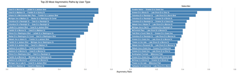
  </a>
  <figcaption>
    Figure 38: Top 20 most asymmetric ride paths by user type. 
  </figcaption>
</figure>
- **Top 20 most asymmetric ride paths**
  Asymmetry ratio is calculated as the proportion of rides taken in one direction relative to the total rides between two stations. Distinct path preferences emerge between Customers and Subscribers.
  - [View entry »](viz/Top_20_Most_Asymmetric_Paths.md){target="_blank"}
  - [Full-size image »](images/Top_20_Most_Asymmetric_Paths.png){target="_blank"}

<figure class="float-right" id="fig39">
  
  <figcaption>
  Figure 39: Top 20 station pairs with the most directional imbalance by user type.
  </figcaption>
</figure>

- **Top 20 Most Asymmetric Paths by User Type**
  Bar charts comparing the top 20 most asymmetric bike share paths for Customers and Subscribers. Each bar represents a path with a high one-way trip imbalancemeasured by asymmetry ratio. Customers show high asymmetry around central business district hubs, while Subscriber asymmetries often reflect lakefront access or commuter endpoint behavior.
  - [View entry »](viz/Top_20_Most_Asymmetric_Paths_by_User_Type.md){target="_blank"}
  - [Full-size image »](/images/Top_20_Most_Asymmetric_Paths_by_User_Type.png){target="_blank"}

##### Key Trends

1. **Customer Asymmetry is Downtown-Centric**
   - Strong directional flows are centered around Canal St, Clinton St, Wacker Dr, and transit hubs.
   - Likely reflects one-way sightseeing trips, drop-offs, or transitions to other transit modes.

2. **Subscriber Asymmetry Aligns with Recreation & Commute**
   - High asymmetry observed along Columbus Dr, Streeter Dr, Lake Shore Dr, and destinations like Millennium Park or McCormick Place.
   - Indicates use patterns shaped by recreation and predictable commuting behavior.

##### Behavioral Insight

- **Asymmetry Ratio** (rides in one direction / total rides) approaching 1.0 reflects pronounced one-way behavior.
- Customer behavior suggests fluid, urban-tourism-based usage where returns often happen by walking, transit, or not at all.
- Subscriber behavior shows structured routines and preferences for scenic or efficient routes, often with predictable directional bias (e.g., ride in, train home).

##### Operational Relevance

- Persistent asymmetries represent logistical challenges for fleet rebalancing.
- High-asymmetry routes may benefit from:
   - **Incentives** to encourage return trips,
   - **Station capacity adjustments**,
   - **Redistribution planning during** peak usage periods.

##### Interpretive Summary

- While both user types show asymmetry, their spatial footprints differ:
  - Customers: core-focused, incidental travel.
  - Subscribers: edge-focused, intentional, possibly scheduled travel.
- This difference reveals how each group interacts with the network infrastructure and informs targeted strategies for **system optimization**.

---

### Recommendations

Recommendations are grouped into two categories:

1   **Take Action with Existing Data**
    -  Focus Subscriber recruitment efforts at combined-use stations (those with both high Subscriber and high Customer use). These locations offer the greatest opportunity to reach likely Subscribers without wasting resources.
    -  Avoid stations dominated by one user type, such as tourist-heavy stations (high Customer %) or commuter-heavy hubs (high Subscriber %), where conversions are less likely.
    -  Design messaging campaigns around use cases we can detect now, such as midday riders ("Lunch & Ride") or first/last-mile commuters at major transit hubs.

2   **Improve Data Collection Capabilities**
    -  Begin collecting optional identifying information (e.g., opt-in email, zip code) to enable customer segmentation and direct outreach.
    -  Investigate cost-effective bike tracking options (e.g., GPS devices) to understand actual rider paths, enabling better infrastructure planning and rebalancing.
    -  Incorporate optional demographic data to improve equity analysis and targeted messaging.

---

## Next Steps

To operationalize these recommendations, we propose the following next steps:

-  Determine budget for pilot outreach campaign in order to determine its size.
   -  Once the number of stations to be included in the pilot is known, rank Stations by User Mix and Volume
   -  Use ride data to identify stations with highest levels of both Subscribers and Customers.
   -  Target these stations for pilot outreach.

-  Design and Deploy a Pilot Campaign
   -  Create simple, location-based advertising (flyers, signage, QR codes) at selected stations.
   -  Test messages tied to observed patterns like midday riding or commuting.

-  Legal and Technical Feasibility Study
   -  Evaluate the privacy and technical implications of collecting user-level identifiers.
   -  Draft opt-in language for future implementation.

-  Bike Tracking Feasibility Assessment
   -  Research GPS vendor options.
   -  Estimate cost and define success metrics for a limited pilot.

-  Team Engagement
   -  Share findings with marketing and operations.
   -  Assign owners for the outreach pilot and the data enhancement study.

## Appendix

Additional resources related to this report are provided below for reference and further exploration:

### Visualizations

[Visualizations Compendium](viz/visualizations.qmd): A curated collection of all visual outputs generated during this project, including analysis,
  interpretation, and methodology.
  
  - Interactive Visuals
    - [Top Stations Map](viz/visualizations.qmd#top-stations-map-leaflet)
    - [Tableau Sheets](viz/visualizations.qmd#tableau-sheets)
  - Static Visualizations
    - [Temporal Patterns](viz/visualizations.qmd#temporal-patterns)
    - [Temperature and Weather Effects](viz/visualizations.qmd#temperature-and-weather-effects)
    - [Ride Duration and Distance Distributions](viz/visualizations.qmd#ride-duration-and-distance)
    - [Spatial Patterns](viz/visualizations.qmd#spatial-patterns)
    - [Fleet & Usage Patterns](viz/visualizations.qmd#fleet-usage-patterns)
    - [Route Asymmetry](viz/visualizations.qmd#route-asymmetry)
    - [ScreenShots](viz/visualizations.qmd#screenshots)

### Provenance

Detailed provenance information describing the origin, acquisition, and processing of the dataset is
 maintained in a separate file to avoid duplication and to enable independent versioning.

The [**Provenance**](data/provenance.qmd) is broken down in the following sections:

 - [SQL Tables](data/provenance.qmd#sql-tables)
 - [SQL Views](data/provenance.qmd#sql-views)
 - [R Data Frames](data/provenance.qmd#r-data-frames)
 - [CSV Files](data/provenance.qmd#csv-files)
 - [RDS Files](data/provenance.qmd#rds-files)
 - [Miscellaneous Files](data/provenance.qmd#miscellaneous-files)

### Schema

The full Schema for the SQLite database is listed in the source archive.

[**schema.sql:**](../src/schema.sql)

 -  SQL DDL statements defining all tables and views
 -  Data types and constraints
 -  Indexes and relationships

### Tools Used

**[SQLite](https://www.sqlite.org/)**  
Served as the central data store for large-scale tables and computationally intensive queries. Offered a portable and efficient solution for handling over 28 million ride records and weather data.

- **Key R libraries for SQLite integration**:
  - [`DBI`](https://cran.r-project.org/package=DBI), [`RSQLite`](https://cran.r-project.org/package=RSQLite), and [`dbplyr`](https://cran.r-project.org/package=dbplyr) for seamless database access and SQL abstraction  
  - [`dplyr`](https://cran.r-project.org/package=dplyr), [`tidyr`](https://cran.r-project.org/package=tidyr), and [`lubridate`](https://cran.r-project.org/package=lubridate) for data wrangling and time-aware transformations  
  - [`leaflet`](https://cran.r-project.org/package=leaflet) for dynamic, interactive station mapping

**[DuckDB](https://duckdb.org/)**  
Used for fast, in-memory SQL operations during exploratory analysis. Particularly effective for joining and filtering intermediate R data frames without modifying the main SQLite schema.

**[Tableau](https://www.tableau.com/)**  
Chosen for its ability to deliver polished, highly interactive dashboards. Used for final presentations involving path-based filtering, click-driven exploration, and spatial overlays.

**[Kumu](https://kumu.io/)**  
Provided system-style, network-based visualizations that highlighted interconnections among stations, routes, and other elements. Supplemented traditional plots with conceptual relationship mapping.

**[Gnuplot](http://www.gnuplot.info/)**  
Employed during early exploration and cleaning, especially when working outside RStudio. Enabled quick, scriptable charts for validation and trend detection.

**[Quarto](https://quarto.org/)**  
Used to author, render, and organize the entire report. Enabled integration of R code, visualizations, and narrative in a reproducible, literate programming format.

**[Git](https://git-scm.com/)** & **[GitHub](https://github.com/)**  
Version control was managed with Git. All source files, including scripts, Quarto documents, and data artifacts, are hosted on GitHub. The final report is published via **[GitHub Pages](https://pages.github.com/)**, ensuring transparency and reproducibility.

### Supplementary Technical Resources

The following technical artifacts are included to support transparency, reproducibility, and further exploration of this case study:

- [Work Log](../logs/workLog.md): A detailed technical journal documenting the development of this case study from initial data acquisition through schema evolution, data cleaning, weather integration, and exploratory analysis. Includes tooling decisions, troubleshooting notes, validation steps, and side explorations such as geospatial file decoding and performance optimization.

- [Source Code Repository](https://github.com/sasgithub/Data_Analytics_cs): Contains all scripts, SQL schema definitions, and supporting materials used in this analysis. Refer to the README for setup instructions and file descriptions.

[^covid]: Divvy Bikes ride data from June 13th 2013 to April 30th 2025 with the exception of the COVID-19 Pandemic, as that data is not representative of normal bike usage.
[^precision]: Many rides prior to 2018 were recorded with minute-level timestamp precision, resulting in durations clustered at exact multiples of 60 seconds. See the [Timestamp Precision Transition](#timestamp-precision-transition) section for details.
[^real]:  From Wabash Ave & 87th St to Central St & Girard Ave on Sun Aug 12 2018 from 12:35:02 PM CDT to 03:27:11 PM CDT 
[^round]: Percentages rounded to the nearest whole number.
[^tied]: Tied with 1 departure each Commercial Ave & 90th St Eggleston Ave & 111th St Sheridan Rd & Buena Ave Wabash Ave & Cermak Rd
[^least]: Tied with 1 arrival each Ashland Ave & Division St 
Broadway & Barry Ave Cityfront Plaza Dr & Pioneer Ct Clinton St & Lake St Clinton St & Roosevelt Rd Clybourn Ave & Division St Columbus Dr & Randolph St Commercial Ave & 90th St Daley Center Plaza Daley Center Plaza Halsted St & 37th St Kingsbury St & Erie St Sedgwick St & Webster Ave Sheridan Rd & Irving Park Rd
[^tiny]:  Western Ave & 62nd St
[^max]:  Daley Center Plaza Corral
[^tourist]:  These stations were found to be within 600 m of the stations in the [Tourist Attractions Dataset](#tourist-attractions).  This is not an exhaustive list of tourist attractions in the Chicago are.
