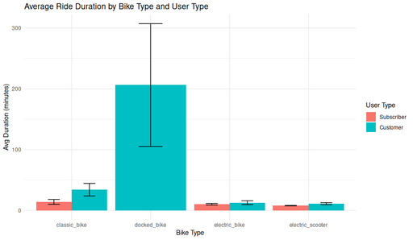

#### Average Ride Duration by Bike Type and User Type

<figure class="float-right">
  <a href="../images/Avg_Ride_Duration_by_Bike_and_User_type_post_elec.png" target="_blank" title="Select image to open full sized chart">
  
  </a>
  <figcaption>
  FIGCAPTION
  </figcaption>
</figure>


The chart titled "Average Ride Duration by Bike Type and User Type" visualizes the average duration (in minutes) of rides for different bike types, segmented by user type (Subscriber vs Customer).

*** Key observations:

    Bike Types: The chart includes classic_bike, docked_bike, electric_bike, and electric_scooter.
    User Types:
        Subscribers (in red)
        Customers (in blue/turquoise)

*** Findings:

    Docked Bike:
        Customers have by far the highest average ride duration (over 200 minutes, with a large error bar indicating significant variability).
        Subscribers do not appear to use docked bikes (no red bar for this category).

    Classic Bike:
        Customers have a higher average ride duration than subscribers.
        Both user types' durations are much lower than for docked bikes, with customers averaging around 30-40 minutes and subscribers around 15 minutes.

    Electric Bike and Electric Scooter:
        Both user types have similar, relatively low average durations (around 10-15 minutes), with customers slightly higher than subscribers.

*** General Insight:

    Customers (non-subscribers) tend to take much longer rides than subscribers, especially on docked bikes.
    Subscribers generally have shorter, more consistent ride durations across all bike types.
    The variability (as shown by the error bars) is particularly large for docked bikes used by customers.


```R
ggplot(post_electric_rides_df, aes(x = bike_type, y = rides_per_day, fill = user_type)) +
  geom_bar(stat = "identity", position = "stack") +
  labs(
    title = "Average Daily Rides by Bike Type and User Type",
    x = "Bike Type",
    y = "Average Rides per Day",
    fill = "User Type"
  ) +
  theme_minimal()
```
