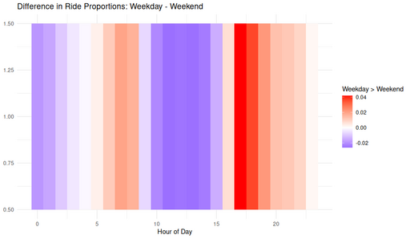

#### Difference in Ride Proportions Weedkay to Weekend

<figure class="float-right">
  <a href="../images/Difference_in_Ride_Proportions_Weekday-Weekend.png" target="_blank" title="Select image to open full sized chart">
  
  </a>
  <figcaption>
Hourly difference in ride proportions: Weekday minus Weekend. Red tones highlight hours where weekday rides are more frequent proportionally; blue tones highlight hours dominated by weekend activity.
  </figcaption>
</figure>

##### 📝 Image Notes

Title: Difference in Ride Proportions: Weekday - Weekend
X-axis: Hour of Day (0–23)
Y-axis: Arbitrary (used to create banded heatmap effect)
Color Scale:

-    Red: Higher ride proportion on weekdays
-    Blue: Higher ride proportion on weekends
-    White: No significant difference in proportion

Interpretation

-    Morning hours (~7–9 AM) and afternoon hours (~4–6 PM) are clearly more active on weekdays, likely driven by commuting.

-    Midday (10 AM–3 PM) shows a higher proportional share of rides on weekends, possibly indicating more recreational usage during these hours.
-    Nighttime hours (~8 PM onward) still lean toward weekday use, albeit more modestly.

This visualization normalizes by total weekday and weekend ride volume, enabling meaningful comparison of usage patterns across the day regardless of total volume differences.


'''R

 ride_query <- sprintf("
   SELECT
     ride_id,
     start_time,
     end_time,
     start_station_id,
     end_station_id,
     bike_type
   FROM rides
   WHERE user_type = 1
     AND start_station_id IN (%s)
     AND end_station_id IN (%s)
     AND start_time >= strftime('%%s', '2023-01-01')
", station_ids_sql, station_ids_sql)
 
non_tourist_customer_rides_df <- dbGetQuery(con, ride_query)

non_tourist_customer_rides_df <- non_tourist_customer_rides_df %>%
  mutate(
    ride_date = as.Date(as.POSIXct(start_time, origin = "1970-01-01")),
    day_of_week = weekdays(ride_date),
    month = format(ride_date, "%B"),
    season = case_when(
      month %in% c("December", "January", "February") ~ "Winter",
      month %in% c("March", "April", "May") ~ "Spring",
      month %in% c("June", "July", "August") ~ "Summer",
      month %in% c("September", "October", "November") ~ "Fall"
    )
  )

# Add week, month, season
non_tourist_customer_rides_df <- non_tourist_customer_rides_df %>%
  mutate(
    start_datetime = as.POSIXct(start_time, origin = "1970-01-01", tz = "America/Chicago"),
    day_of_week = wday(start_datetime, label = TRUE, abbr = FALSE),
    month = month(start_datetime, label = TRUE, abbr = FALSE),
    season = case_when(
      month(start_datetime) %in% c(12, 1, 2) ~ "Winter",
      month(start_datetime) %in% c(3, 4, 5)  ~ "Spring",
      month(start_datetime) %in% c(6, 7, 8)  ~ "Summer",
      month(start_datetime) %in% c(9, 10, 11) ~ "Fall"
    )
  )

# Convert UTC to Chicago local time
non_tourist_customer_rides_df <- non_tourist_customer_rides_df %>%
  mutate(
    start_datetime = as.POSIXct(start_time, origin = "1970-01-01", tz = "UTC"),
    start_localtime = with_tz(start_datetime, tzone = "America/Chicago")
  )


rides_by_hour_weekpart <- non_tourist_customer_rides_df %>%
  mutate(hour = lubridate::hour(start_localtime),
         week_part = ifelse(lubridate::wday(start_localtime) %in% c(1, 7), "Weekend", "Weekday")) %>%
  group_by(week_part, hour) %>%
  summarise(ride_count = n(), .groups = "drop")


ride_props <- rides_by_hour_weekpart %>%
  group_by(week_part) %>%
  mutate(prop = ride_count / sum(ride_count))

prop_wide <- ride_props %>%
  select(hour, week_part, prop) %>%
  tidyr::pivot_wider(names_from = week_part, values_from = prop) %>%
  mutate(diff = Weekday - Weekend)
'''

```R
ggplot(prop_wide, aes(x = hour, y = 1, fill = diff)) +
     geom_tile() +
     scale_fill_gradient2(low = "blue", high = "red", mid = "white", midpoint = 0) +
     labs(
         title = "Difference in Ride Proportions: Weekday - Weekend",
         x = "Hour of Day",
         y = NULL,
         fill = "Weekday > Weekend"
     ) +
     theme_minimal()
```
