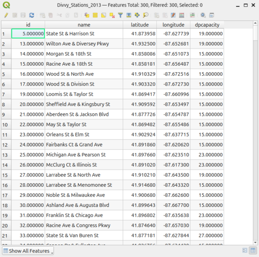

#### Divvy Stations Table

<figure class="float-right">
  
  <figcaption>
  QGIS screenshot
  </figcaption>
</figure>

This is a screenshot of the Divvy_Stations_2013 table taken from QGIS

This screenshot was not used in the case study it is included only for completeness and to support narrative details.

  

