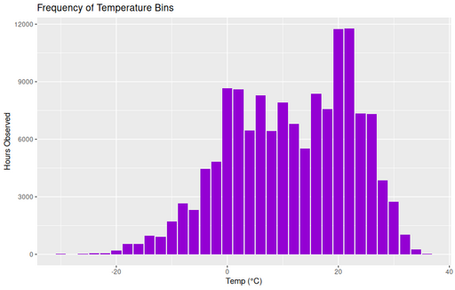

#### Frequency of Temperature Bins

<figure class="float-right">
  <a href="../images/Frequency_of_Temp_bins.png" target="_blank" title="Select image to open full sized chart">
  
  </a>
  <figcaption>
    Frequency distribution of hourly temperature observations during the analysis period, illustrating data coverage across temperature ranges.
  </figcaption>
</figure>

##### Overview

This histogram shows how often each 2°C temperature range occurred in the underlying weather dataset. It helps contextualize the density of data points used in other temperature-related analyses, particularly the scarcity of very hot or very cold hours.

##### Chart Details

- **X-Axis:** Temperature Bin (°C), grouped in 2-degree intervals.
- **Y-Axis:** Number of hourly records falling within each bin.
- **Bars:** Height proportional to frequency of observations per bin.

##### Observations

- The majority of observations cluster between ~5°C and ~25°C.
- Very few hours fall below -10°C or above 30°C.
- This uneven distribution explains why temperature-related charts show more stable trends in mid-range temperatures but can become volatile at extremes.

##### Interpretation

The chart demonstrates that the dataset’s coverage is concentrated in moderate temperatures, suggesting caution when interpreting trends at temperature extremes due to sparse data.

##### Data Sources

- **Weather Data:** Hourly observations from Chicago Midway Airport via Meteostat Bulk Hourly Dataset.
  - Includes air temperature, dewpoint, humidity, precipitation, and other weather variables.
- **Timeframe:** Coverage aligned to available trip data (2013–2019 and 2023–2025), although this chart includes all available hourly weather records regardless of whether rides occurred.

##### Data Preparation

- Hourly temperature records loaded into SQLite.
- Temperature rounded down to nearest 2°C bin (`floor(temp / 2) * 2`).
- Counts aggregated per bin using `dplyr` in R.

##### R Code Used to Generate Chart:

```r
# Create temperature bins and count occurrences
temp_bins <- hourly_weather_df %>%
  mutate(temp_bin = floor(temp / 2) * 2) %>%
  group_by(temp_bin) %>%
  summarise(count = n())

# Plot histogram
ggplot(temp_bins, aes(x = temp_bin, y = count)) +
  geom_col(fill = "steelblue") +
  labs(
    title = "Frequency of Temperature Bins",
    x = "Temperature Bin (°C)",
    y = "Number of Hours"
  ) +
  theme_minimal()

<br style="clear: both;"></br>


```R
ggplot(aes(x = temp_bin, y = n)) +
  geom_col(fill = "gray") +
  labs(title = "Frequency of Temperature Bins", x = "Temp (°C)", y = "Hours Observed")
```

<br style="clear: both;"></br>

