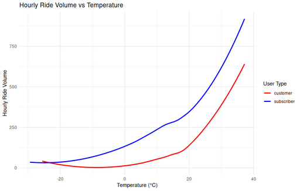

#### Hourly Ride Volume vs Temperature

<figure class="float-right">
  <a href="../images/Hourly_Ride_Volume_vs_Temperature.png" target="_blank" title="Select image to open full sized chart">
  
  </a>
  <figcaption>
  [LOESS]{#glossary-LOESS}-smoothed hourly ride volume as a function of temperature, comparing customers and subscribers. Patterns remain elevated at higher temperatures due to the smoothing method.
  </figcaption>
</figure>

##### Overview

  [LOESS]{#glossary-LOESS}-smoothed hourly ride volume as a function of temperature, comparing customers and subscribers. Patterns remain elevated at higher temperatures due to the smoothing method.

- **X-Axis:** Air temperature in °C.
- **Y-Axis:** Number of rides per hour.
- **Lines:** [LOESS]{#glossary-LOESS} smooth for each user type.
  - **Blue:** Subscribers.
  - **Red:** Customers.

##### Observations

- Ride counts rise with temperature from below 0°C through the 20s.
- Unlike binned histograms, no clear decline is visible above ~30°C.
- Customer volume grows faster with temperature than subscriber volume.

##### Interpretation

The continuous [LOESS]{#glossary-LOESS} smoothing aggregates all hours (including some without rides), potentially obscuring the decline at extreme temperatures seen in binned charts. This chart reflects the *overall association* between hourly temperatures and ridership, rather than the distribution of rides alone.

##### Data Sources

- **Trip Data:** Divvy trip records from:
  - 2013–2019 (S3 archive)
  - 2023–2025 (City of Chicago Data Portal)
- **Weather Data:** Chicago Midway Airport hourly observations via Meteostat.

##### Data Preparation

- Rides aggregated per hour and user type (`COUNT(*) AS rides`).
- Weather joined on hourly epoch timestamp (`start_time / 3600 * 3600`).
- No filter applied to exclude zero-ride hours (i.e., hours with no rides are included as 0).
- Used as input to [LOESS]{#glossary-LOESS} smoothing, resulting in a different trend shape compared to temperature bin summaries.


##### R Code Used to Generate Chart:

```R
ggplot(rides_weather_df, aes(x = temp, y = rides, color = user_type)) +
  geom_smooth(method = "loess", se = FALSE) +
  scale_y_continuous(labels = label_number(scale_cut = cut_short_scale())) +
  scale_color_manual(values = c("subscriber" = "blue", "customer" = "red")) +
  labs(
    title = "Hourly Ride Volume vs Temperature",
    x = "Temperature (°C)",
    y = "Hourly Ride Volume",
    color = "User Type"
  ) +
  theme_minimal()
```

<br style="clear: both;"></br>
