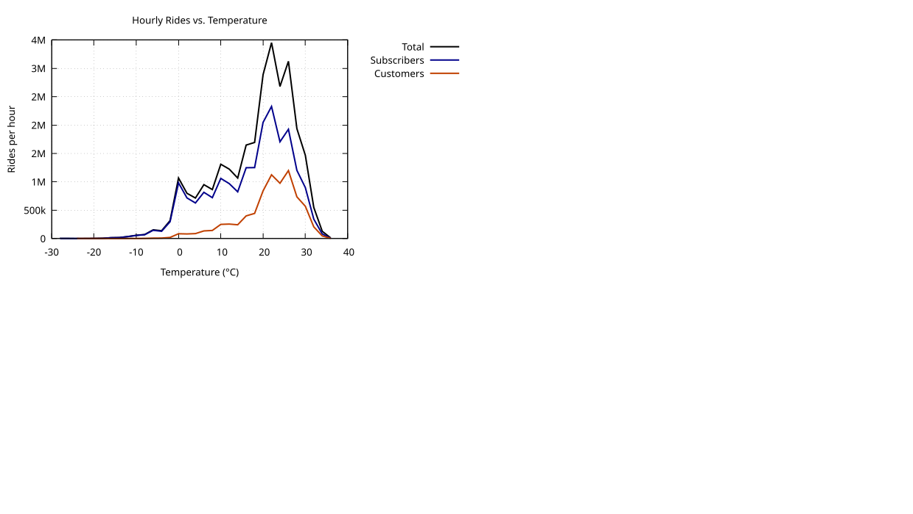

#### Hourly Rides vs. Temperature (2°C bins)

<figure class="float-right">
  <a href="../images/Hourly_Rides_vs_Temp.svg" target="_blank" title="Select image to open full sized chart">
  
  </a>
  <figcaption>
  Hourly ride counts by temperature bin, with separate curves for Total, Subscriber, and Customer rides. Warmer temperatures strongly correlate with increased bike usage, especially among Customers.
  </figcaption>
</figure>

This chart illustrates the relationship between **ambient temperature (°C)** and the **number of rides** starting at that temperature. Data is grouped into **2°C bins** to smooth short-term fluctuations and reveal broader trends.

##### Chart Details

- **X-Axis:** Temperature in degrees Celsius.
- **Y-Axis:** Total number of rides per bin, formatted with metric suffixes (e.g., 1k, 1M).
- Grid lines and a legend outside the plot area improve readability.
- Three ride categories are plotted:
  - **Total Rides** (black line)
  - **Subscribers** (dark blue line)
  - **Customers** (dark orange line)

##### Observations

- Bike usage increases steadily with warmer weather, peaking for both Subscribers and Customers around **26°C (78.8°F)**, after which it falls off sharply.
- **Customers** display a steeper increase in usage with temperature, suggesting stronger sensitivity to warm conditions.
- **Subscribers** maintain higher baseline usage in cooler temperatures but follow a similar bell-shaped curve overall.

##### Interpretation

- These trends highlight temperature as a powerful predictor of ridership.
- The steeper response among Customers may reflect their recreational or discretionary usage.
- Insights from this pattern can inform:
  - **Operations** (e.g., fleet redistribution, maintenance scheduling)
  - **Marketing campaigns** (e.g., promoting rides during optimal weather windows)

##### Data Sources

- **Hourly Weather Data:** Chicago Midway Airport hourly weather observations (temperature, precipitation, etc.)
- **Ride Data:** Aggregated hourly ride counts joined to weather records by timestamp.
- **Period:** All available data between 2013 and 2025.

##### Data Preparation

Below is the SQL command used to prepare the dataset:

```sql
.headers off
.mode tabs
.output temp_vs_rides.tsv

WITH binned AS (                          -- 2 °C comfort‑oriented buckets
    SELECT
        CAST(temp / 2.0 AS INT) * 2              AS temp_bin,         -- –10,‑8,…,34
        r.user_type,
        SUM(r.rides)                             AS rides
    FROM rides_per_hour_tbl   AS r
    JOIN hourly_weather       AS w  ON w.epoch = r.epoch
    GROUP BY temp_bin, r.user_type
), pivot AS (                             -- turn rows into columns
    SELECT
        temp_bin,
        SUM(rides)                                  AS total,
        SUM(CASE WHEN user_type='subscriber' THEN rides END) AS subs,
        SUM(CASE WHEN user_type='customer'   THEN rides END) AS cust
    FROM binned
    GROUP BY temp_bin
    ORDER BY temp_bin
)
SELECT temp_bin, total, subs, cust
FROM pivot;

.output stdout
```
##### Gnuplot Script Used to Generate Chart:

```gnuplot
set format y "%.0s%c"
set term wxt           
set title "Hourly Rides vs. Temperature"
set xlabel "Temperature (°C)"
set ylabel "Rides per hour"
set grid
set datafile separator '\t'   
set key outside
plot \
    "temp_vs_rides.tsv" every ::1::34 using 1:2 with lines lw 2 lc rgb "black" title "Total", \
    ""      every ::1::34 using 1:3 with lines lw 2 lc rgb "dark-blue" title "Subscribers", \
    ""      every ::1::34 using 1:4 with lines lw 2 lc rgb "dark-orange" title "Customers"
```


