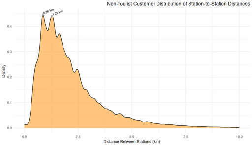

#### Non-Tourist Customer Distribution of Stations to Station Distance

<figure class="float-right">
  <a href="../images/Non-Tourist_Customer_Distribution_of_Station-to-Station_Distance.png" target="_blank" title="Select image to open full sized chart">
  
  </a>
  <figcaption>
  FIGCAPTION
  </figcaption>
</figure>


```R
ggplot(non_loop_rides_df, aes(x = distance_km)) +
geom_density(fill = "darkorange", alpha = 0.5) +
geom_point(data = top_peaks, aes(x = x, y = y), color = "gray", size = 2) +
geom_text(data = top_peaks, aes(x = x, y = y, label = paste0(" ", round(x, 2), " km")),
angle = 25, vjust = 0, hjust = 0, size = 3.5, color = "black") +
labs(
title = "Non-Tourist Customer Distribution of Station-to-Station Distances",
x = "Distance Between Stations (km)",
y = "Density"
) + 
theme_minimal() + 
theme(
plot.title = element_text(hjust = 1) 
)
```


<br style="clear: both;"></br>

