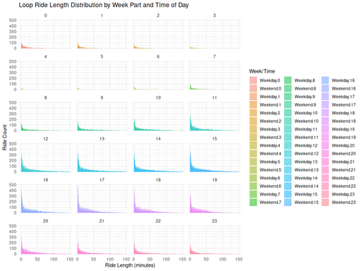

#### Loop Ride Length Distribution by Week Part and Time of Day

<figure class="float-right">
  <a href="../images/Non-Tourist_Customer_Loop_Ride_Length_Distribution.png" target="_blank" title="Select image to open full sized chart">
  
  </a>
  <figcaption>
  Loop ride durations among non-tourist customers show a consistently skewed distribution, regardless of time of day or whether the ride occurred on a weekday or weekend.
  </figcaption>
</figure>

##### Overview

This visualization shows how **loop ride durations** vary by **hour of day** and by whether the ride occurred on a **weekday or weekend**. Each subplot represents a single hour of the day, illustrating patterns of ride duration frequency across time.

##### Chart Details

- **X-Axis:** Ride Length (minutes)
- **Y-Axis:** Ride Count
- **Faceting:** 24 panels, each corresponding to an hour of day (0–23)
- **Color Encoding:** Fill colors differentiate combinations of weekday/weekend and hour
- **Plot Type:** Histogram with bin width = 1 minute

##### Observations

- Rides are **heavily skewed toward short durations** in all panels.
- Most rides fall under **10–15 minutes**, regardless of hour.
- Midday and afternoon periods show slightly higher total counts.
- No clear hour shows a major deviation in distribution shape.

##### Interpretation

- Loop rides are generally **short-duration recreational trips**, rather than commutes.
- The lack of time-of-day variation suggests **consistent rider behavior**.
- The similarity between weekday and weekend distributions reinforces this interpretation.

##### Use Case

This chart supports:

- **Service planning:** anticipating typical ride lengths for rebalancing.
- **User engagement strategies:** targeting short-trip promotions.
- **Operational decisions:** confirming the limited variability in loop ride duration.

##### Technical Notes

- Data limited to **rides starting and ending at the same station** (loop rides).
- Only **non-tourist stations** were included.
- **Bin width** of 1 minute chosen for granularity.
- Duration computed as `end_time - start_time` in minutes.

##### Data Sources

- **Database Table:** `rides`
- **Filtering Criteria:**
  - `start_station_id = end_station_id`
  - `user_type = customer`
  - Excluded known tourist stations
- **Time Zone:** Converted to Chicago local time

##### R Code Used to Generate Chart:

```r
ggplot(loop_rides_non_tourist, aes(x = ride_length_min, fill = interaction(week_part, hour_local))) +
  geom_histogram(binwidth = 1, position = "identity", alpha = 0.5) +
  facet_wrap(~ hour_local, ncol = 4) +
  labs(
    title = "Loop Ride Length Distribution by Week Part and Time of Day",
    x = "Ride Length (minutes)",
    y = "Ride Count",
    fill = "Week/Time"
  ) +
  theme_minimal()
```

