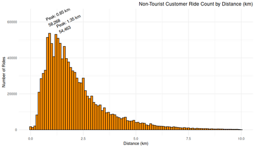

#### Non-Tourist Customer Ride Count by Distance

<figure class="float-right">
  <a href="../images/Non-Tourist_Customer_Ride_Count_by_Distance.png" target="_blank" title="Select image to open full sized chart">
  
  </a>
  <figcaption>
    Ride count by station-to-station distance for non-tourist customer trips, highlighting common trip lengths in the 0–2 km range.
  </figcaption>
</figure>

##### Overview

This bar chart shows the **number of non-tourist customer rides** grouped by the straight-line distance between the starting and ending stations. The visualization makes clear which distance ranges are most commonly traveled.

##### Chart Details

- **X-Axis:** Distance between stations (km), from 0 to 10 km.
- **Y-Axis:** Number of rides in each distance bin (up to ~60,000 rides).
- **Bars:** 
  - Filled in dark orange.
  - Labeled at notable peaks for emphasis.

##### Observations

- **Primary Peaks:**
  - ~0.85 km: 58,268 rides.
  - ~1.35 km: 54,563 rides.
- Sharp drop-off beyond 2 km, with very few rides exceeding 5 km.
- The shape strongly suggests most casual rides occur within a short radius.

##### Interpretation

- **Short trips dominate** non-subscriber usage, likely reflecting quick local errands or last-mile transit.
- Peaks may correspond to popular station pairs located 3–8 blocks apart.
- The pattern mirrors the density distribution of unique station-to-station distances, but here each ride contributes equally to counts.

##### Data Sources

- **Ride Records:** Non-subscriber rides starting after 2023-01-01.
- **Filters Applied:**
  - Excluded loop rides (start station = end station).
  - Limited to non-tourist stations.
  - Calculated distance using Haversine formula between station coordinates.
  - Included only trips with distances ≤10 km.

##### R Code Used to Generate Chart:

```r
# Bin and count rides by distance
ride_counts_by_distance <- non_loop_rides_df %>%
  filter(distance_km <= 10) %>%
  mutate(distance_bin = round(distance_km / 0.1) * 0.1) %>%
  count(distance_bin)

# Plot
ggplot(ride_counts_by_distance, aes(x = distance_bin, y = n)) +
  geom_col(fill = "darkorange", width = 0.08) +
  geom_text(
    data = filter(ride_counts_by_distance, distance_bin %in% c(0.85, 1.35)),
    aes(label = paste0("Peak: ", distance_bin, " km\n", scales::comma(n))),
    vjust = -0.5,
    size = 3.5
  ) +
  labs(
    title = "Non-Tourist Customer Ride Count by Station-to-Station Distance",
    x = "Distance Between Stations (km)",
    y = "Number of Rides"
  ) +
  theme_minimal()

<br style="clear: both;"></br>

