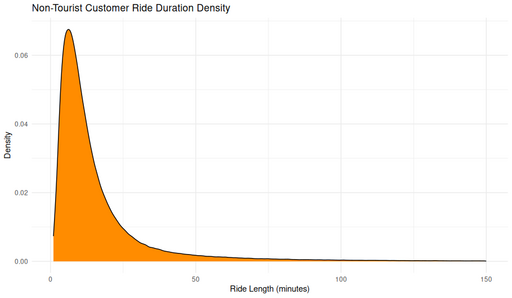

#### Non-Tourist Customer Ride Duration Density

<figure class="float-right">
  <a href="../images/Non-Tourist_Customer_Ride_Duration_Density.png" target="_blank" title="Select image to open full sized chart">
  
  </a>
  <figcaption>
    Ride Duration Density for Non-Tourist Customer Trips.<br>
    This smoothed density plot shows how ride lengths are distributed among customer (non-subscriber) rides that do not involve tourist stations.
  </figcaption>
</figure>

##### Overview

This density plot illustrates the **distribution of ride durations** (in minutes) for trips taken by **non-tourist customers**. The visualization focuses on how frequently different ride lengths occur, highlighting the most common trip durations.

##### Chart Details

- **X-Axis:** Ride Length (minutes), typically ranging from 0 to ~150.
- **Y-Axis:** Density (smoothed probability density).
- **Plot Style:** Single density curve filled in orange to show concentration of rides.

##### Observations

- The distribution is **sharply right-skewed**, with most rides lasting under ~15 minutes.
- A clear peak appears between ~6–10 minutes, reflecting short urban trips.
- The long tail shows occasional longer rides, although these are much less frequent.

##### Interpretation

- Short rides dominate customer usage patterns, consistent with quick errands or intra-neighborhood trips.
- The lack of a secondary peak suggests relatively uniform short-duration behavior among these riders.
- Longer rides may represent recreational trips or exploratory use.

##### Use Case

This visualization is useful for:
- Understanding the central tendency and spread of ride lengths.
- Supporting decisions about pricing (e.g., time-based fees).
- Tailoring operational planning for short-trip dominance among customer riders.

##### Technical Notes

- **Data Filtering:**
  - Only includes `customer` rides.
  - Excludes trips starting or ending at tourist stations.
- **Ride Length Calculation:**
  - `(end_time - start_time) / 60`.
- **Kernel Bandwidth:** Auto-selected by `ggplot2`.

##### Data Sources

- **Data Frame:** `non_tourist_customer_rides_df`
  - Created by filtering the `rides` table to include only customer trips with relevant station IDs.
  - Converted timestamps to local time for consistency.

##### R Code Used to Generate Chart:

```r
ggplot(non_tourist_customer_rides_df, aes(x = ride_length_min)) +
  geom_density(fill = "darkorange") +
  labs(
    title = "Non-Tourist Customer Ride Duration Density",
    x = "Ride Length (minutes)",
    y = "Density"
  ) +
  theme_minimal()
```
<br style="clear: both;"></br>

