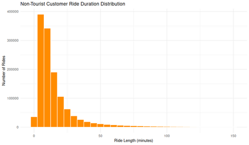

#### Non-Tourist Customer Ride Duration Distribution

<figure class="float-right">
  <a href="../images/Non-Tourist_Customer_Ride_Duration_Distribution.png" target="_blank" title="Select image to open full sized chart">
  
  </a>
  <figcaption>
    Distribution of ride durations for non-tourist customer trips.<br>
    The histogram shows that the vast majority of trips are short in duration, tapering off beyond 20 minutes.
  </figcaption>
</figure>

##### Overview

This histogram depicts the **distribution of ride durations** (in minutes) for casual rides that start and end outside tourist areas. Each bar represents the count of trips falling within a 5-minute interval.

##### Chart Details

- **X-Axis:** Ride Length (minutes), binned in 5-minute increments.
- **Y-Axis:** Number of rides in each duration bin.
- **Bars:** Filled in dark orange with white borders for clarity.

##### Observations

- The distribution is **heavily right-skewed**, with most rides lasting under ~15–20 minutes.
- A clear peak appears in the **0–5 minute bin**, highlighting frequent short trips.
- Frequency decreases rapidly as duration increases.
- Occasional longer trips are visible in the long tail.

##### Interpretation

- Casual riders overwhelmingly use the system for **short trips**.
- The lack of secondary peaks suggests uniform trip purposes, likely errands or last-mile transport.
- Longer rides may reflect recreational or exploratory use, but they are relatively rare.

##### Use Case

This chart is helpful for:

- Informing policies about time-based pricing tiers.
- Understanding baseline trip durations among casual riders.
- Supporting planning of rebalancing or maintenance cycles.

##### Technical Notes

- **Data Filtering:**
  - Includes only `customer` rides.
  - Excludes tourist station trips.
- **Ride Length Calculation:**
  - `(end_time - start_time) / 60`.
- **Bin Width:**
  - 5 minutes.

##### Data Sources

- **Data Frame:** `non_tourist_customer_rides_df`
  - Filtered from the `rides` table by user type and station criteria.

##### R Code Used to Generate the Chart:

```r
ggplot(non_tourist_customer_rides_df, aes(x = ride_length_min)) +
  geom_histogram(binwidth = 5, fill = "darkorange", color = "white") +
  labs(
    title = "Non-Tourist Customer Ride Duration Distribution",
    x = "Ride Length (minutes)",
    y = "Number of Rides"
  ) +
  theme_minimal()
```
