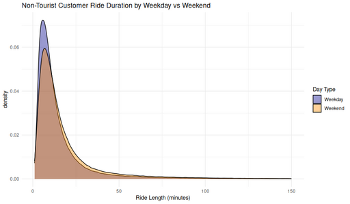

#### Ride Duration Distribution by Weekday vs Weekend (Non-Tourist Customers)

<figure class="float-right">
  <a href="../images/Non-Tourist_Customer_Ride_Duration_by_Weekday_vs_Weekend.png" target="_blank" title="Select image to open full sized chart">
    
  </a>
  <figcaption>
    Ride Duration Distribution by Day Type (Customer Rides Only).<br>
    This density plot shows the distribution of ride durations in minutes for non-tourist customer rides, separated by weekdays and weekends. Weekday rides tend to peak slightly earlier and higher than weekend rides, indicating a stronger presence of short utility trips during the work week.
  </figcaption>
</figure>

##### Overview

This kernel density plot compares **ride durations (in minutes)** for non-tourist customer bike rides, distinguishing between **weekday** and **weekend** behavior. It focuses exclusively on **non-subscriber** riders whose trips did **not** start or end near tourist destinations.

##### Chart Details

- **X-Axis:** Ride Length (minutes), ranging from 0 to 150.
- **Y-Axis:** Density (smoothed kernel estimation).
- **Colors:**
  - **Weekday (Blue):** Tighter concentration at shorter durations.
  - **Weekend (Orange):** Broader peak, more long-duration variability.
- **Plot Type:** Density plot with alpha blending to show overlap.

##### Observations

- **Weekday rides** are shorter on average, peaking around 6–8 minutes, suggesting quick trips.
- **Weekend rides** peak later (~8–10 minutes) and show a longer tail.
- Both distributions are **right-skewed**, confirming the majority of rides are under ~15 minutes.

##### Interpretation

- Weekday trips are likely **task-focused** (errands, commuting).
- Weekend trips are more **discretionary** and potentially recreational.
- The consistent shape across days supports the idea of habitual short-distance usage among non-tourist customers.

##### Use Case

This chart can be applied to:

- Demand modeling and pricing strategies sensitive to day type.
- User segmentation based on duration patterns.
- Planning operational resources around expected trip lengths.

##### Technical Notes

- **Data Filtering:**
  - `user_type = customer`
  - Excluded known tourist stations.
- **Duration:** Calculated as `(end_time - start_time) / 60`.
- **Kernel Bandwidth:** Automatically selected by `ggplot2`.
- Rides over 150 minutes excluded to improve interpretability.

##### Data Sources

- **Data Frame:** `non_tourist_customer_rides_df`
  - Derived from the `rides` table filtered for customer trips, start/end station IDs, and date range.
  - Preprocessed with timezone adjustment to Chicago local time.

##### R Code Used to Generate Chart:

```r
ggplot(non_tourist_customer_rides_df, aes(x = ride_length_min, fill = week_part)) +
  geom_density(alpha = 0.4) +
  scale_fill_manual(values = c("Weekday" = "darkblue", "Weekend" = "darkorange")) +
  labs(
    title = "Non-Tourist Customer Ride Duration by Weekday vs Weekend",
    x = "Ride Length (minutes)",
    fill = "Day Type"
  ) +
  theme_minimal()
```
