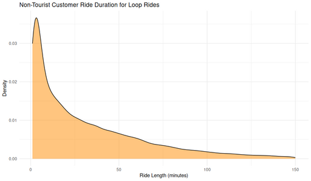

#### Non-Tourist Customer Ride Duration for Loop Rides

<figure class="float-right">
  <a href="../images/Non-Tourist_Customer_Ride_Duration_for_Loop_Rides.png" target="_blank" title="Select image to open full sized chart">
  
  </a>
  <figcaption>
  Ride duration density for non-tourist loop rides taken by customers. The strong concentration of short rides suggests quick, casual trips returning to the same station.
  </figcaption>
</figure>

##### Overview
This density plot shows the **distribution of ride lengths (in minutes)** for customer rides that **start and end at the same station**—so-called **loop rides**—excluding trips involving tourist stations.

##### Chart Details
- **X-Axis:** Ride Length (minutes), ranging from 0 to 150.
- **Y-Axis:** Density (area under curve sums to 1).
- **Fill Color:** Orange shading under the curve.

##### Observations
- Clear peak between **3–7 minutes**, indicating many short loop trips.
- Steady decline in frequency as ride durations increase.
- Very long rides (over ~60 minutes) are rare but do exist.

##### Interpretation
- The strong skew toward short rides reinforces the idea that many loop trips are **quick, casual uses**, possibly for errands or brief leisure.
- The lack of a secondary peak suggests there is not a distinct long-ride group among non-tourist customers.

##### Technical Notes
- This subset was filtered to include only **loop rides** (`start_station_id == end_station_id`) and to exclude known tourist stations.
- Durations are calculated as ride end time minus start time, expressed in minutes.
- Smoothed density estimation was applied rather than a histogram.

##### R Code Used to Generate the Chart
Unfortunately, the exact R code could not be recovered.  
However, it likely resembled:

```r
ggplot(loop_rides_non_tourist_df, aes(x = ride_length_min)) +
  geom_density(fill = "orange", alpha = 0.6) +
  labs(
    title = "Non-Tourist Customer Ride Duration for Loop Rides",
    x = "Ride Length (minutes)",
    y = "Density"
  ) +
  theme_minimal()
```
<br style="clear: both;"></br>

