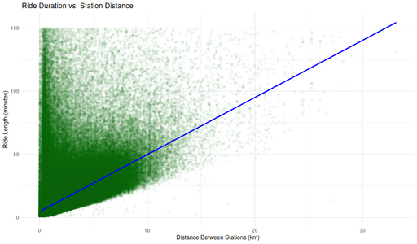

#### Ride Duration vs. Station Distance (Non-Tourist Customers)

<figure class="float-right">
  <a href="../images/Non-Tourist_Customer_Ride_Duration_vs_Station_Distance.png" target="_blank" title="Select image to open full sized chart">
  
  </a>
  <figcaption>
  Ride Duration vs. Station Distance (Non-Tourist Customer Rides)<br>
  This scatterplot displays the relationship between ride length and distance between stations. While longer distances generally correspond to longer durations, many short-distance rides also exhibit long durations, suggesting varied usage patterns. A linear reference line highlights the lower boundary of likely direct trips.
  </figcaption>
</figure>

##### Overview
This scatterplot shows the relationship between **ride duration** and **station-to-station distance** for non-tourist customer rides. A linear reference line illustrates the general trend.

##### Chart Details
- **X-Axis:** Distance Between Stations (km), 0–30.
- **Y-Axis:** Ride Duration (minutes), 0–150.
- **Points:** Green dots for individual rides.
- **Line:** Blue linear fit (least squares).

##### Observations
- Dense cluster of short rides with low durations.
- High variance: many short trips took long times.
- Sparse long-distance trips with a broad range of durations.
- Blue line suggests the fastest plausible rides for a given distance.

##### Interpretation
- Clear positive correlation between distance and time.
- Wide variability suggests many rides included stops, detours, or leisurely pacing.

##### Use Case
- Identify outlier usage patterns.
- Understand trip efficiency and routing behavior.
- Inform operational planning for short vs. long trips.

##### Data Sources
- **Ride Data:** Non-tourist customer rides filtered to exclude trips that start and end at the same station.
- **Station Coordinates:** Merged from cleaned station dataset(s).
- **Time Frame:** 2023 onward, as defined in the project scope.

##### R Code Used to Generate the Chart

```r
library(ggplot2)
ggplot(non_loop_rides_df, aes(x = distance_km, y = ride_length_min)) +
  geom_point(alpha = 0.05, color = "darkgreen") +
  geom_smooth(method = "lm", se = FALSE, color = "blue") +
  labs(
    title = "Ride Duration vs. Station Distance",
    x = "Distance Between Stations (km)",
    y = "Ride Length (minutes)"
  ) +
  theme_minimal()
```
