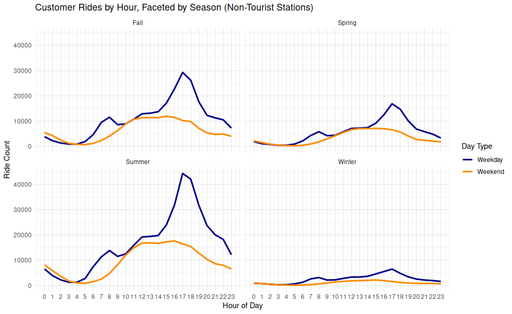

#### Customer Rides by Hour, Faceted by Season (Non-Tourist Stations)

<figure class="float-right">
  <a href="../images/Non-Tourist_Customer_Ride_by_Hour_Faceted_by_Season.png" target="_blank" title="Select image to open full sized chart">
  
  </a>
  <figcaption>
  Hourly customer ride patterns by season at non-tourist stations. Weekday rides peak strongly in the late afternoon during warmer seasons, while weekend rides are more evenly distributed. Winter shows the lowest activity overall.
  </figcaption>
</figure>

##### Overview

This faceted line chart visualizes customer rides over the hours of the day, separated by season and by weekday/weekend. It highlights how ridership patterns shift throughout the year.

##### Chart Details

-  X-Axis: Hour of Day (0–23)
-  Y-Axis: Ride Count
-  Facets: One panel per season (Spring, Summer, Fall, Winter)

- Line Colors:
  -  Blue: Weekday
  -  Orange: Weekend

##### Purpose

To illustrate how both time of day and seasonality affect customer ride behavior when excluding tourist-heavy stations.

##### Observations

-  Spring: Moderate volume, clear late afternoon weekday peak
-  Summer: Highest usage, pronounced 17:00 weekday peak
-  Fall: Similar shape to Spring, slightly lower counts
-  Winter: Flat distribution, significantly reduced activity

##### Interpretation

-  Commuting Behavior: Strong summer/fall weekday peaks around 17:00 suggest commuter-driven use, especially among customers using the system for one-way travel from work or transit.
-  Recreation and Errands: Weekend rides are more spread throughout midday.
-  Seasonal Sensitivity: Weekend ride patterns are flatter across the day and more seasonally stable, while weekday patterns show strong seasonal variation.
-  Cold Weather Impact: Ridership drops sharply in winter across all times of day.

##### Technical Notes

- Timestamps were converted to local Chicago time.
- Day-of-week was used to classify rides into “Weekday” vs “Weekend”.
- Seasonal classification was derived from ride start dates.
- All rides were filtered to exclude tourist station IDs before analysis.

##### Data & Methods

**Data Source**

Data Frame: rides_by_hour_season

This dataframe includes:

- Filtered out tourist stations
- Filtered to customer rides
- Derived season from start timestamp
- Derived week_part from day of week
- Aggregated ride counts by hour, season, and day type

**R Code Used to Generate the Chart:**

```r
ggplot(rides_by_hour_season, aes(x = hour, y = ride_count, color = week_part)) +
  geom_line(size = 1.1) +
  facet_wrap(~season, ncol = 2) +
  scale_x_continuous(breaks = 0:23) +
  scale_color_manual(values = c("Weekday" = "darkblue", "Weekend" = "darkorange")) +
  labs(
    title = "Customer Rides by Hour, Faceted by Season (Non-Tourist Stations)",
    x = "Hour of Day",
    y = "Ride Count",
    color = "Day Type"
  ) +
  theme_minimal()
```

<br style="clear: both;"></br>

