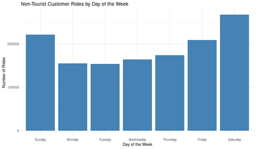

#### Non-Tourist Customer Rides by Day of the Week

<figure class="float-right">
  <a href="../images/Non-Tourist_Customer_Rides_by_Day_of_the_Week.png" target="_blank" title="Select image to open full sized chart">
  
  </a>
  <figcaption>
  Total customer rides per day of week at non-tourist stations, highlighting the clear weekend peaks in ridership.
  </figcaption>
</figure>

##### Overview

This bar chart displays the total number of **customer rides** at **non-tourist stations**, grouped by day of the week. By focusing on non-tourist stations, the visualization emphasizes local usage patterns rather than rides taken by visitors.

##### Chart Details

- **X-Axis**: Day of the week (Sunday through Saturday)
- **Y-Axis**: Total ride count per day
- **Bars**: Aggregate counts of rides initiated by customers at non-tourist stations

##### Purpose

To illustrate weekly patterns in casual (customer) ridership among local users, highlighting which days see higher or lower activity.

##### Observations

- **Weekends (Saturday and Sunday)**: Highest ride volumes, indicating strong recreational or leisure usage.
- **Weekdays (Monday–Friday)**: Lower and relatively consistent ride counts compared to weekends.
- **Peak day**: Saturday shows the most activity overall.

##### Interpretation

- The clear weekend peak suggests most customer rides are discretionary trips taken for leisure rather than routine commuting.
- The relative uniformity of weekday rides indicates a stable but smaller base of casual usage during the workweek.

##### Technical Notes

- Rides were filtered to:
  - `customer` user type (not subscribers)
  - Exclude all tourist stations
- Day of week extracted from ride start timestamps (converted to local time)

##### Data & Methods

###### Data Source:

  - Pre-processed dataframe `non_tourist_customer_rides_df`
    - Filtered by:
      - Non-tourist station IDs
      - `customer` user type


###### R Code Used to Generate Chart:

```r
ggplot(non_tourist_customer_rides_df, aes(x = day_of_week)) +
     geom_bar(fill = "steelblue") +
     labs(
         title = "Non-Tourist Customer Rides by Day of the Week",
         x = "Day of the Week",
         y = "Number of Rides"
     ) +
     theme_minimal()
```

<br style="clear: both;"></br>

