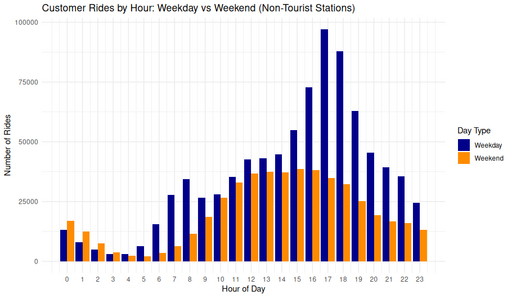

## Customer Rides by Hour: Weekday vs Weekend (Non-Tourist Stations)

<figure class="float-right">
  <a href="../images/Non-Tourist_Customer_Rides_by_Hour_Weekday_vs_Weekend.png" target="_blank" title="Select image to open full sized chart">
  
  </a>
  <figcaption>
  FIGCAPTION
  </figcaption>
</figure>


```R
ggplot(rides_by_hour_weekpart, aes(x = hour, y = ride_count, fill = week_part)) +
geom_col(position = "dodge") +
labs(
title = "Customer Rides by Hour: Weekday vs Weekend (Non-Tourist Stations)",
x = "Hour of Day",
y = "Number of Rides",
fill = "Day Type"
) +
scale_x_continuous(breaks = 0:23) +
scale_fill_manual(values = c("Weekday" = "darkblue", "Weekend" = "darkorange")) +
theme_minimal()
```

<br style="clear: both;"></br>

