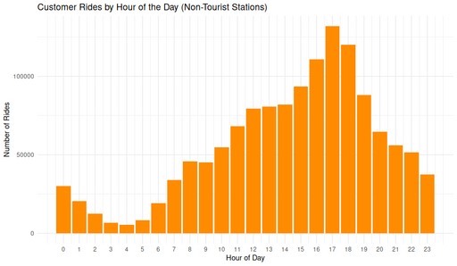

#### Non-Tourist Customer Rides by Hour of Day

<figure class="float-right">
  <a href="../images/Non-Tourist_Customer_Rides_by_Hour_of_Day.png" target="_blank" title="Select image to open full sized chart">
  
  </a>
  <figcaption>
  Hourly distribution of customer rides originating from non-tourist stations, showing peak activity in the late afternoon.
  </figcaption>
</figure>


##### Overview

This bar chart shows how **customer rides** at **non-tourist stations** vary across the 24-hour day. By excluding rides from stations frequently used by tourists, this visualization highlights local usage patterns, such as commuting or neighborhood trips. Excluding sightseeing or visitor behavior as much as possible.

##### Chart Details

- **X-Axis**: Hour of day (0 = midnight, 23 = 11 PM)
- **Y-Axis**: Number of rides started in each hour
- **Bars**: Hourly ride counts by customer users at non-tourist stations

##### Purpose

To identify when non-tourist customer rides occur most frequently and to reveal possible commuter or routine daily patterns among local riders.

##### Observations

- **Early morning (0–5 AM)**: Minimal activity.
- **Morning ramp-up (6–11 AM)**: Gradual increase as the day progresses.
- **Midday plateau (12–15 PM)**: Consistent moderate ride volume.
- **Peak period (16–18 PM)**: Pronounced spike with the highest volume around 17:00.
- **Evening taper (19–23 PM)**: Gradual decline but still notable usage into the night.

##### Interpretation

The clear peak around **5 PM** suggests:
- After-work recreation or errands.
- Possible casual commuting behavior.
The modest morning volume and sustained midday usage indicate that, while some rides may be utilitarian, many are likely discretionary trips by locals.

##### Technical Notes

- Tourist stations were excluded based on a curated station ID list.
- Rides filtered to `customer` user type.
- All timestamps converted to Chicago local time.
- Bin width: 1 hour per bar.

##### Data & Methods

###### Data Source:

  - Pre-processed dataframe `rides_by_hour_weekpart`
    - Filtered by:
      - Non-tourist station IDs
      - `customer` user type
      - time converted to local time


###### R Code Used to Generate Chart:

```r
ggplot(rides_by_hour_weekpart, aes(x = hour, y = ride_count, fill = week_part)) +
    geom_col(position = "dodge") +
    labs(
        title = "Non-Tourist Customer Rides by Hour of Day",
        subtitle = "Adjusted to Chicago Local Time",
        x = "Hour of Day",
        y = "Ride Count",
        fill = "Day Type"
    ) +
    scale_x_continuous(breaks = 0:23) +
    theme_minimal()
```

<br style="clear: both;"></br>

