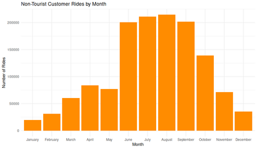

#### Non-Tourist Customer Rides by Month

<figure class="float-right">
  <a href="../images/Non-Tourist_Customer_Rides_by_Month.png" target="_blank" title="Select image to open full sized chart">
  
  </a>
  <figcaption>
   Monthly distribution of customer rides at non-tourist stations, illustrating clear seasonality in usage patterns.
  </figcaption>
</figure>

##### Overview

This bar chart displays the total number of rides initiated by customers (non-subscribers) at non-tourist stations, aggregated by calendar month. It shows clear seasonal patterns in ridership.

##### Chart Details

-  X-Axis: Month (1 = January, 12 = December).
-  Y-Axis: Total ride count for each month.
-  Bars: Orange fill indicates the count of rides starting in each month.

##### Purpose

This visualization is intended to illustrate seasonal variation in usage, excluding tourist-heavy locations to focus on local customer ridership.

##### Observations

-  Winter (Dec–Feb): Lowest ridership, likely due to cold weather.
-  Spring (Mar–May): Steady increase as temperatures rise.
-  Summer Peak (June–August): Highest ridership, peaking in July.
-  Fall Decline (Sept–Nov): Gradual reduction in usage as temperatures cool.

##### Interpretation

    The clear summer peak suggests that casual riders strongly prefer warm-weather months.

    The exclusion of tourist stations reinforces that these are local usage patterns, not driven primarily by visitors.

    Winter ridership does not drop to zero, indicating some year-round demand.

##### Data & Methods

**Data Source:**

-  non_tourist_customer_rides_df
  -  Filtered to include:
     -  user_type == "customer"
     -  start_station_id in the non-tourist station list

**R Code Used Generate :**
```R
ggplot(non_tourist_customer_rides_df, aes(x = month)) +
     geom_bar(fill = "darkorange") +
     labs(
         title = "Non-Tourist Customer Rides by Month",
         x = "Month",
         y = "Number of Rides"
     ) +
     theme_minimal()
```

<br style="clear: both;"></br>

