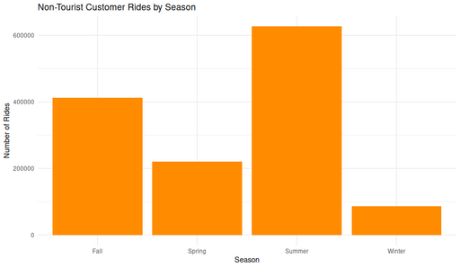

#### Non-Tourist Customer Rides by Season

<figure class="float-right">
  <a href="../images/Non-Tourist_Customer_Rides_by_Season.png" target="_blank" title="Select image to open full sized chart">
  
  </a>
  <figcaption>
  Total customer rides originating at non-tourist stations, aggregated by season. Summer shows the highest volume, with winter substantially lower.
  </figcaption>
</figure>

##### Overview

This bar chart summarizes the total ride volume by season for customers using non-tourist stations. It helps illustrate seasonal variability in casual riding behavior.

##### Chart Details

-  X-Axis: Season (Spring, Summer, Fall, Winter)
-  Y-Axis: Number of rides
-  Bar Fill: Solid dark orange

##### Purpose

This chart highlights how seasonal factors influence casual ridership, such as weather and daylight availability, independent of tourist activity.

###### Observations

-  Summer: Rides peak sharply, exceeding 600,000 rides—reflecting warm weather and extended daylight hours.
-  Fall: Second-highest ridership, over 400,000 rides, showing sustained use into cooler months.
-  Spring: More modest totals (~220,000 rides), likely reflecting a gradual ramp-up in riding.
-  Winter: Lowest ridership (under 200,000), consistent with reduced bike use in cold conditions.

##### Interpretation

-  The strong seasonal trend underscores the importance of temperature and daylight in casual rider behavior.
-  Even excluding tourist hotspots, ridership in summer triples or quadruples winter levels.
-  These patterns can inform resource allocation (e.g., rebalancing bikes) and maintenance scheduling.

##### Data & Methods

###### Data Source:

Filtered rides from the dataset:
-  non_tourist_customer_rides_df
  -  Filters Applied:
     -  user_type = customer
     -  Start station ID in non-tourist stations list

###### R Code Used to Generate Chart:

```R
ggplot(non_tourist_customer_rides_df, aes(x = season)) +
     geom_bar(fill = "darkorange") +
     labs(
         title = "Non-Tourist Customer Rides by Season",
         x = "Season",
         y = "Number of Rides"
     ) +
     theme_minimal()
```

<br style="clear: both;"></br>
