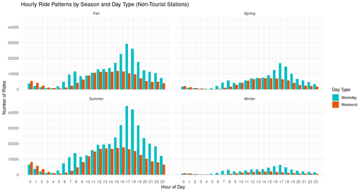

## Hourly Ride Patterns by Season and Day Type (Non-Tourist Stations)

<figure class="float-right">
  <a href="../images/Non-Tourist_Hourly_Ride_Patterns_by_Season_and_Day_type.png" target="_blank" title="Select image to open full sized chart">
  
  </a>
  <figcaption>
  FIGCAPTION
  </figcaption>
</figure>


```R
ggplot(rides_by_hour_season, aes(x = hour, y = ride_count, fill = week_part)) +
  geom_col(position = "dodge") +
  facet_wrap(~season, ncol = 2) +
  scale_x_continuous(breaks = 0:23) +
  scale_fill_manual(values = c("Weekday" = "darkblue", "Weekend" = "darkorange")) +
  labs(
    title = "Hourly Ride Patterns by Season and Day Type (Non-Tourist Stations)",
    x = "Hour of Day",
    y = "Number of Rides",
    fill = "Day Type"
  ) +
  theme_minimal()
```

<br style="clear: both;"></br>

