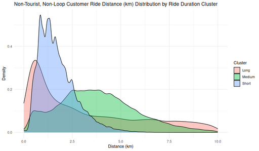

#### Ride Distance Distribution by Duration Cluster (Non-Tourist, Non-Loop, Customers)

<figure class="float-right">
  <a href="../images/Non-Tourist_Non-Loop_Customer_Ride_Distance_Distribution_by_Ride_Duration_Cluster.png" target="_blank" title="Select image to open full sized chart">
  
  </a>
  <figcaption>
    Ride Distance Distribution by Duration Cluster (Customer Rides Only)<br>
    This density plot compares ride distances for non-tourist, non-loop customer rides, grouped into clusters based on ride duration. Short-duration rides are tightly concentrated around 1–2 km, medium-duration rides cover a broader 2–6 km range, and long-duration rides extend further, reflecting distinct usage behaviors within the same user group.
  </figcaption>
</figure>

##### Overview

This kernel density plot illustrates the distribution of **ride distances** (in kilometers) for **non-tourist, non-loop customer rides**, broken out by **ride duration clusters** labeled Short, Medium, and Long. Clustering these customer rides by duration helps uncover distinct usage patterns — such as short errand-like trips versus longer recreational journeys — without needing to segment riders any further or rely on additional metadata.

##### Chart Details

- **X-Axis (Distance in km)**:
  - Ranges from 0 to 10 km.
  - Represents the straight-line distance between start and end stations (minimum possible distance). Note: this is **not** actual path distance.

- **Y-Axis (Density)**:
  - Probability density of ride distances within each cluster.
  - Higher peaks = more common distances.

- **Cluster Colors**:
  - **Short (Blue)** – sharp peak around 1–2 km.
  - **Medium (Green)** – broad distribution across ~2.5–6 km.
  - **Long (Red/Pink)** – flatter spread across 3–10 km.

##### Observations

- **Short rides**:
  - Highest density overall.
  - Strong preference for distances under 3 km.
- **Medium rides**:
  - Broadest range of distances.
  - Transitional usage pattern overlapping short and long rides.
- **Long rides**:
  - Less frequent but cover widest distance range.

##### Interpretation

- Short-duration trips are likely local, last-mile or neighborhood errands.
- Medium rides reflect mixed use: commuting and recreation.
- Long rides are more destination-focused or leisurely.

##### Use Case

This chart helps:
- Understand non-tourist customer ride behavior segmented by trip duration.
- Support targeted strategies for operations and pricing.
- Inform planning of infrastructure, such as dock placement or service areas.

##### Data Sources

- **Ride Records**: Filtered to exclude subscriber rides, tourist stations, and loop rides (rides that start and end at the same station).
- **Distance Calculation**: Haversine distance between station coordinates.

###### R Code Used to Generate the Chart:

```r
ggplot(non_loop_rides_df, aes(x = distance_km, fill = duration_cluster)) +
  geom_density(alpha = 0.5) +
  scale_fill_manual(values = c(
    "Short" = "blue",
    "Medium" = "green",
    "Long" = "red"
  )) +
  labs(
    title = "Non-Tourist, Non-Loop Customers Ride Distance (km) Distribution by Ride Duration Cluster",
    x = "Distance (km)",
    y = "Density",
    fill = "Duration Cluster"
  ) +
  theme_minimal()
```


