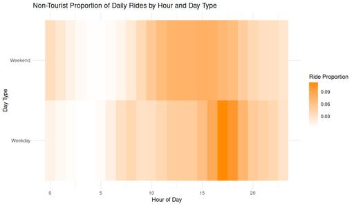

#### Non-Tourist Proportion of Daily Rides by Hour and Day Type

<figure class="float-right">
  <a href="../images/Non-Tourist_Proportion_of_Daily_Rides_by_Hour_and_Day_Type.png" target="_blank" title="Select image to open full sized chart">
  
  </a>
  <figcaption>
    Proportion of daily non-tourist rides by hour of day and day type (weekday vs. weekend). Weekdays show a clear peak in the late afternoon commute hours, while weekends have a more uniform midday distribution.
  </figcaption>
</figure>

##### Overview

This heatmap shows the **hourly share of total daily rides** for non-tourist customer rides, split by **day type** (Weekday vs. Weekend). Darker colors indicate higher proportions of each day’s total rides occurring in that hour.

##### Chart Details

- **X-Axis (Hour of Day):**
  - Ranges from 0 to 23.
  - Represents the ride start hour in local time.

- **Y-Axis (Day Type):**
  - Two categories: Weekday and Weekend.

- **Fill Color (Proportion):**
  - Gradient from white (low) to dark orange (high).
  - Indicates the fraction of the day’s total rides occurring in each hour.

##### Observations

- **Weekdays:**
  - Clear late afternoon peak around **17:00–18:00**, consistent with evening commute patterns.
  - Lower activity in early morning and late evening.

- **Weekends:**
  - More even distribution across **10:00–16:00**, suggesting recreational or discretionary use.
  - No strong commute-style spike.

##### Interpretation

- The contrast between weekday and weekend timing supports the hypothesis that weekday rides are more likely commuting or errands, while weekend rides are more leisurely.
- Operators could align staffing, bike redistribution, or promotions to these temporal patterns.

##### Use Case

This chart can help:
- Model hourly demand by day type.
- Optimize fleet distribution and availability during peak periods.
- Inform marketing or pricing strategies aligned to usage timing.

##### Data Sources

- **Ride Records:** Filtered for non-tourist customer rides (excluding stations flagged as tourist destinations).
- **Derived Columns:** Hour extracted from local start time; day type assigned as Weekday or Weekend.
- **Aggregation:** Hourly counts normalized to proportions of each day’s total rides.

###### R Code Used to Generate the Chart:

```r
ggplot(ride_props, aes(x = hour, y = week_part, fill = prop)) +
  geom_tile() +
  scale_fill_gradient(low = "white", high = "darkorange") +
  labs(
    title = "Non-Tourist Proportion of Daily Rides by Hour and Day Type",
    x = "Hour of Day",
    y = "Day Type",
    fill = "Ride Proportion"
  ) +
  theme_minimal()
```
