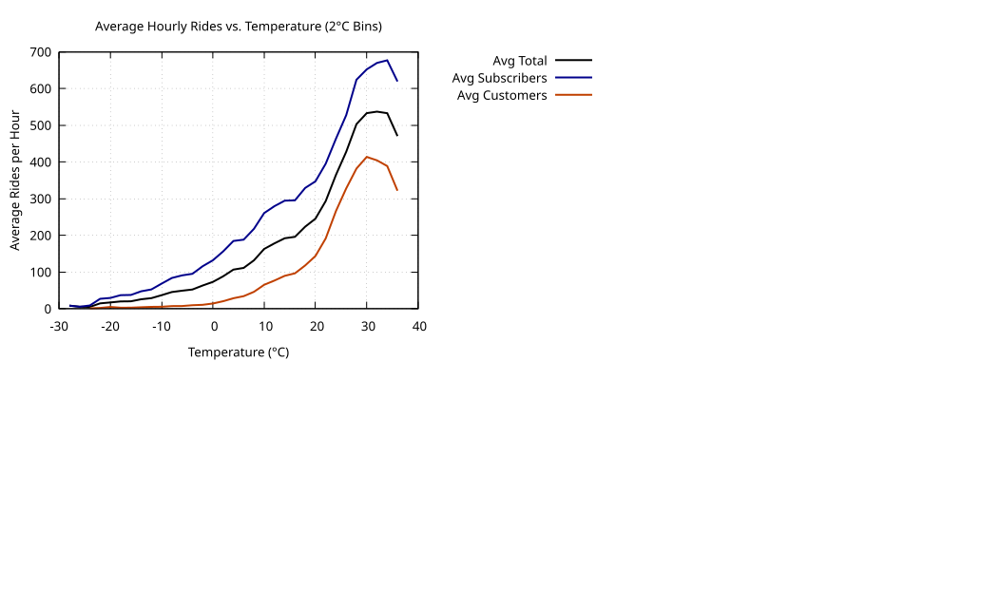

### 📊 Chart Description: Normalized Average Hourly Rides vs Temperature

<figure class="chartbox">
  <a href="../images/Avg_Hourly_Rides_vs_Temp.svg" target="_blank" title="Select image to open full-sized chart">
    
  </a>
  <figcaption class="small-caption">
    Normalized average hourly rides by temperature (°C), showing subscriber, customer, and total ride volume peaking near 25°C.
  </figcaption>
</figure>


This line chart displays how bike ride frequency varies with temperature, separated by user type. The data is normalized, meaning each line ranges from 0 to 1 to emphasize the shape of the trend rather than absolute ride counts. The x-axis shows temperature in degrees Celsius, and the y-axis shows normalized average hourly rides.

There are three colored lines:

-  Dark blue line for Subscribers
-  Dark orange line for Customers
-  Black line for the Total (combined average)

### 📈 What the chart shows:

    All three lines follow a similar bell-shaped curve, indicating that ride volume increases with temperature up to a point and then declines slightly.

Below 5°C:
:   All lines are low. Subscribers still ride more than customers, but both are at their lowest levels.

From 5°C to 25°C:
:   All user types increase their riding sharply, with customers increasing more rapidly than subscribers.

Around 25°C:
:   The normalized ride volume peaks for all users. This temperature appears to be optimal for biking.

Beyond 30°C:
:   Ride volume begins to decline slightly, especially for customers, suggesting heat discourages casual riding more than subscriber riding.

### 📊 Comparison by User Type:

    Customers (dark orange line) are more sensitive to temperature changes. They ride less in the cold and more in warm weather, but their participation falls more steeply when it's too hot.

    Subscribers (dark blue line) have a flatter, more stable curve, meaning their ride behavior is more consistent across a range of temperatures, likely because they are commuting or riding out of necessity.

    The Total line (black) always lies between the two other lines, as expected from an average.

### 🔍 General Observations:

    The shape of the curves is very similar across all user types, indicating that temperature influences casual customers and subscribers in a similar way — warmer weather increases ridership for everyone.

    The "total" line (black) consistently lies between the customer (dark orange) and subscriber (dark blue) lines, as expected from an average or composite.

### 🌡️ Temperature Effects:

Below ~5°C (≈ 41°F):
:   All ride volumes are low. This likely reflects discomfort, poor road conditions, or safety concerns — especially for casual riders.

5°C to 25°C:
:   Steady and significant rise in ride volume, particularly among customers. This temperature range is ideal for recreational and commuter use. It suggests good biking weather for most users.

Around 25°C (~77°F):
:   Appears to be the peak ridership temperature — the "sweet spot" for biking in Chicago (or similar climates), with maximum participation across both customer types.

Above 30°C (~86°F):
:   Slight drop-off in ride frequency, especially among casual riders, implying that excessive heat becomes a deterrent to non-essential trips. Subscribers are less affected, possibly due to commuting needs or higher tolerance.

### 🤔 Behavioral Insights (Celsius Context):
|Temp Range (°C)|Customer Behavior|Subscriber Behavior|Interpretation|
|<5°C|Low ridership|Moderately low|Cold weather suppresses casual rides more strongly|
|5–25°C|Steep increase|Moderate increase|Warm-up boosts ridership, especially casual use|
|~25°C|Peak ridership|Near-peak|Ideal biking conditions for both groups|
|>30°C|Drop or plateau|Slight decline or steady|Hot weather reduces recreational riding|

📊 Comparison by User Type:

-   Customers (dark orange line) are more sensitive to temperature changes. They ride less in the cold and more in warm weather, but their participation falls more steeply when it's too hot.

-   Subscribers (dark blue line) have a flatter, more stable curve, meaning their ride behavior is more consistent across a range of temperatures, likely because they are commuting or riding out of necessity.

-  The Total line (black) always lies between the two other lines, as expected from an average.


### ✅ Conclusion:

Casual users are more sensitive to weather extremes, while subscribers demonstrate more consistent use—likely reflecting commute and utility rather than leisure.

### Production Details

####R source code used to produce the chart

```R
ggplot(normalized_df, aes(x = temp_bin, y = normalized_rides, color = user_type)) +
    geom_line(size = 1.2) +
    labs(
        title = "Normalized Avg Hourly Rides vs Temperature",
        x = "Temperature (°F)",
        y = "Normalized Avg Hourly Rides",
        color = "User Type"
    ) +
    scale_color_manual(values = c("subs" = "darkblue", "cust" = "darkorange", "avg" = "black")) +
    theme_minimal()
```

### Data Source

```R
> avg_df  <- readr::read_csv("/data/temp_vs_rides_avg.csv")
> # Normalize each column to 0-1
> normalized_df <- avg_df %>%
+     mutate(across(c(subs, cust, avg), ~ (. - min(.)) / (max(.) - min(.)))) %>%
+     pivot_longer(cols = c(subs, cust, avg), names_to = "user_type", values_to = "normalized_rides")
```

