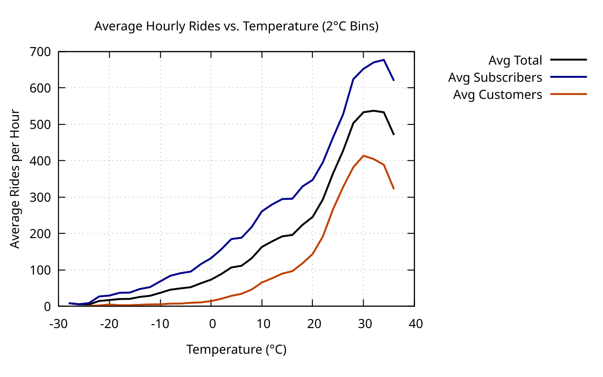

#### Normalized Average Hourly Rides vs Temperature

<figure class="float-right">
  <a href="../images/Avg_Hourly_Rides_vs_Temp.svg" target="_blank" title="Select image to open full-sized chart">
    
  </a>
  <figcaption>
    Normalized average hourly rides by temperature (°C), showing subscriber, customer, and total ride volume peaking near 25°C.
  </figcaption>
</figure>

##### Overview

This line chart displays how bike ride frequency varies with temperature, separated by user type. Data is **normalized**, meaning each series is scaled between 0 and 1 to emphasize **trend shape** rather than absolute counts.

##### Chart Details

- **X-Axis (Temperature °C):**
  - Ranges approximately -10°C to +35°C.
- **Y-Axis (Normalized Average Hourly Rides):**
  - Scaled 0–1 within each series.
- **Lines:**
  - **Dark blue:** Subscribers.
  - **Dark orange:** Customers.
  - **Black:** Combined total average.

##### Observations

- All series follow a **bell-shaped curve**, peaking near **25°C (~77°F)**.
- **Below 5°C:**
  - All ride volume is very low.
- **5–25°C:**
  - Sharp increase in ridership, especially among customers.
- **>30°C:**
  - Slight decline in rides, more pronounced for customers.

##### Interpretation

- **Subscribers:** More consistent usage, reflecting commuting or necessity.
- **Customers:** More sensitive to temperature, showing higher warm-weather peaks and steeper hot/cold drop-offs.
- The normalized pattern confirms **temperature is a primary driver** for all user types.

##### Behavioral Insights

| Temperature Range | Customer Behavior | Subscriber Behavior | Interpretation |
|--------------------|--------------------|---------------------|----------------|
| <5°C | Very low ridership | Moderately low | Cold strongly suppresses casual rides |
| 5–25°C | Steep increase | Moderate increase | Warmer weather encourages use |
| ~25°C | Peak ridership | Near-peak | Ideal riding conditions |
| 30-25°C | Decline | Slight increase | Heat discourages casual trips |
| >35°C |Sharp Decline| Sharp Decline | Extreme heat discourages all trips |

##### Use Case

This visualization is useful for:

- Understanding seasonal ride patterns.
- Modeling demand sensitivity to weather.
- Designing promotions and fleet strategies.

##### Data Sources

- **Ride Counts:** Aggregated hourly ride counts per user type.
- **Temperature:** Hourly observations joined on timestamp.
- **Normalization:** Each series scaled to [0–1].

##### R Code Used to Generate the Chart:

```r
ggplot(normalized_df, aes(x = temp_bin, y = normalized_rides, color = user_type)) +
  geom_line(size = 1.2) +
  labs(
    title = "Normalized Avg Hourly Rides vs Temperature",
    x = "Temperature (°C)",
    y = "Normalized Avg Hourly Rides",
    color = "User Type"
  ) +
  scale_color_manual(values = c("subs" = "darkblue", "cust" = "darkorange", "avg" = "black")) +
  theme_minimal()
```
