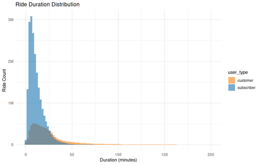

#### Ride Duration Distribution by User Type

<figure class="float-right">
  <a href="../images/Ride_Duration_Distribution.png" target="_blank" title="Select image to open full sized chart">
    
  </a>
  <figcaption>
    Ride duration distribution for customers and subscribers. Subscriber rides tend to be shorter and more consistent, while customer rides show a broader range.
  </figcaption>
</figure>

##### Overview

This histogram shows how ride durations differ between **Subscribers** and **Customers**. The distribution is plotted as a count of rides by duration (in minutes), revealing distinct usage patterns between user types.

##### Chart Details

- **X-Axis:** Ride duration in minutes, from 0 to 200 minutes.
- **Y-Axis:** Count of rides in each duration bin.
- **Bars:**
  - **Blue (Subscribers):** Rides tightly clustered around shorter durations.
  - **Orange (Customers):** Rides more spread out, with a longer tail.
- **Bin Width:** 2 minutes per bar.

##### Purpose

This visualization compares usage patterns between customers and subscribers, showing that the two groups engage with the bike share system very differently in terms of how long they ride.

##### Observations

- **Subscribers:**
  - Majority of rides are under 30 minutes.
  - Strong peak around 10–15 minutes.
  - Rapid drop-off after 30 minutes, suggesting time-constrained rides (possibly to avoid overage fees).

- **Customers:**
  - Ride duration distribution is flatter and broader.
  - Significant number of rides extend beyond 30 minutes.
  - Tail extends beyond 100 minutes, though with diminishing frequency.

##### Interpretation

- **Subscriber rides** are likely utilitarian—commutes or quick errands—and shaped by pricing plans that encourage shorter trips.
- **Customer rides** are more exploratory or recreational, often longer and less time-sensitive.
- The chart highlights a fundamental behavioral difference in how the system is used by each group.

##### Technical Notes

- Duration is measured from ride start to ride end.
- Rides over 200 minutes are excluded for scale clarity.
- The bin width used here is 2 minutes, offering good resolution of short trips.

##### R Code Used to Generate Chart

```r
ggplot(ride_durations, aes(x = duration_min, fill = user_type)) +
  geom_histogram(binwidth = 2, position = "identity", alpha = 0.6) +
  labs(
    title = "Ride Duration Distribution",
    x = "Duration (minutes)",
    y = "Ride Count"
  ) +
  scale_fill_manual(values = c("subscriber" = "#1f77b4", "customer" = "#ff7f0e")) +
  scale_y_continuous(labels = label_number(scale_cut = cut_short_scale())) +
  theme_minimal()
```

