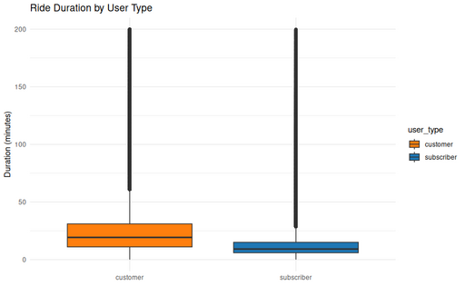

#### Ride Duration by User Type ( box plot )

<figure class="float-right">
  <a href="../images/Ride_Duration_by_User_Type_box.png" target="_blank" title="Select image to open full sized chart">
  
  </a>
  <figcaption>
    Box plot of ride durations by user type. Subscribers have shorter, more consistent trips, while customers exhibit longer and more variable ride times.
  </figcaption>
</figure>

##### Overview

This box plot compares the **distribution of ride durations** between subscribers and customers, emphasizing differences in median, spread, and outliers.

##### Chart Details

- **X-Axis:** User Type (Subscriber, Customer).
- **Y-Axis:** Ride Duration in Minutes (0–200 min).
- **Boxes:**
  - Show interquartile range (25th–75th percentile).
  - Central line indicates the median ride duration.
- **Whiskers and Outliers:**
  - Whiskers extend to ~1.5× [interquartile range (IQR)](../glossary.qmd#glossary-IQR).
  - Outliers plotted with low opacity for clarity.

##### Observations

- **Subscribers:**
  - Median ride duration is substantially lower.
  - Tight interquartile range, indicating consistent short trips.
  - Fewer extreme outliers.
- **Customers:**
  - Higher median ride duration.
  - Wide interquartile range, reflecting greater variability.
  - Substantial number of longer-duration outliers.

##### Interpretation

The data reinforces prior findings that:
- **Subscribers** ride mainly for commuting or quick tasks, resulting in shorter, predictable durations.
- **Customers** tend to use bikes more recreationally, leading to longer, less consistent trips.

##### Data Sources

- **Trip Data:** Divvy rides from:
  - 2013–2019 (S3 archive)
  - 2023–2025 (City of Chicago Data Portal)

###### Data Preparation

**SQL Query Used to Retrieve Data:**

```R
# Connect to the SQLite database
con <- dbConnect(RSQLite::SQLite(), "caseStudy.db")

# Pull ride durations for valid subscriber/customer rides under 60 min
ride_durations <- dbGetQuery(con, "
  SELECT
    CASE user_type
      WHEN 0 THEN 'subscriber'
      WHEN 1 THEN 'customer'
    END AS user_type,
    (end_time - start_time) / 60.0 AS duration_min
  FROM rides
  WHERE user_type IN (0, 1)
    AND end_time > start_time
    AND (end_time - start_time) < 12000
")

# Disconnect
 dbDisconnect(con)
```
###### R Code Used to Generate Chart:

```R
ggplot(ride_durations, aes(x = user_type, y = duration_min, fill = user_type)) +
     geom_boxplot(outlier.alpha = 0.1) +
     labs(title = "Ride Duration by User Type", x = "", y = "Duration (minutes)") +
     scale_fill_manual(values = c("subscriber" = "#1f77b4", "customer" = "#ff7f0e")) +
     theme_minimal()
```
