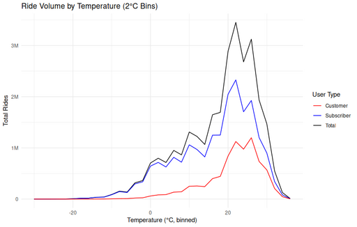

#### Ride Volume by Temperature (2°C Bins)

<figure class="float-right">
  <a href="../images/Ride_Volume_by_Temp_2_bin.png" target="_blank" title="Select image to open full sized chart">
    
  </a>
  <figcaption>
    Total ride volume across 2°C temperature bins, comparing Customers, Subscribers, and the overall total. Warmer temperatures strongly correlate with increased usage.
  </figcaption>
</figure>

##### Overview

This line chart shows the **total number of rides** grouped into **2°C temperature bins**, with separate lines for **Customer**, **Subscriber**, and **Total** ride counts. It highlights how temperature influences ridership over the dataset period.

##### Chart Details

- **X-Axis (Temperature in °C, binned)**:
  - Ranges from approximately –25°C to +35°C.
  - Each point represents a 2-degree bin of hourly temperatures.

- **Y-Axis (Total Rides)**:
  - Ranges from 0 to over 3 million rides per bin.
  - Shows the cumulative ride volume within each temperature range.

- **Line Colors**:
  - **Red** – Customer rides.
  - **Blue** – Subscriber rides.
  - **Black** – Total rides (sum of both).

##### Observations

- **Rising Trend with Temperature**:
  - Rides increase steadily from freezing upward.
  - Peak usage occurs between ~18–25°C.
  
- **Post-Peak Decline**:
  - Ride volume drops sharply above ~25°C, suggesting heat discourages riding.

- **Subscribers Dominate Overall Volume**:
  - At all temperatures, Subscriber rides outnumber Customer rides by a wide margin.
  - Customer volume rises proportionally faster as temperatures warm but remains lower overall.

##### Interpretation

- The **bell-shaped distribution** demonstrates that mid-range temperatures are optimal for riding.
- Both user types respond similarly to seasonal temperature shifts, though Customers show slightly more sensitivity to extremes.

##### Use Case

This visualization can inform:
- Seasonal fleet planning and rebalancing.
- Targeted promotions or outreach during optimal riding weather.
- Infrastructure readiness for peaks in demand.

##### R Code Used to Generate Chart

```r
ggplot(binned_rides, aes(x = temp_bin)) +
    geom_line(aes(y = total, color = "Total")) +
    geom_line(aes(y = subscriber, color = "Subscriber")) +
    geom_line(aes(y = customer, color = "Customer")) +
    scale_color_manual(values = c("Total" = "black", "Subscriber" = "blue", "Customer" = "red")) +
    labs(
        title = "Ride Volume by Temperature (2°C Bins)",
        x = "Temperature (°C, binned)",
        y = "Total Rides",
        color = "User Type"
    ) +
    scale_y_continuous(labels = label_number(scale_cut = cut_short_scale())) +
    theme_minimal()
```
<br style="clear: both;"></br>

