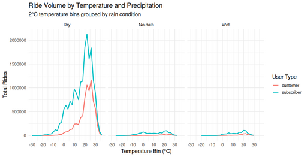

#### Ride Volume by Temperature and Precipitation

<figure class="float-right">
  <a href="../images/Ride_Volume_by_Temp_and_Precipitation.png" target="_blank" title="Select image to open full sized chart">
  
  </a>
  <figcaption>
  Ride Volume by Temperature and Rain Condition
This panel chart shows total ride volume for subscribers and customers, grouped by dry, wet, and unknown precipitation conditions. Most rides occur in dry weather at temperatures between 20–25°C. Wet conditions significantly suppress ridership for both user types, revealing clear sensitivity to rain.
  </figcaption>
</figure>


##### Overview
This line chart panel shows the total ride volume across 2°C temperature bins, broken down by **user type** (Customer vs. Subscriber) and grouped by **rain condition** (Dry, Wet, No data). Each panel represents a different precipitation category, allowing direct comparison of behavior under different weather conditions.

##### Chart Structure

- **X-Axis (Temperature Bin °C)**:
  - Temperature ranges from -30°C to +30°C.
  - Binned in 2°C increments.

- **Y-Axis (Total Rides)**:
  - Number of rides recorded within each temperature bin.

- **Facets (Panels)**:
  - **Dry**: Rides that occurred with no recorded rain.
  - **No data**: Weather data was missing.
  - **Wet**: Rides that occurred during rain conditions.

- **Lines**:
  - **Red**: Customer ride volume.
  - **Cyan**: Subscriber ride volume.

##### Observations

###### Dry Conditions
- **Most ride volume occurs here**, peaking between 20–26°C.
- Subscribers consistently log more rides than customers across all temperature bins.
- Clear bell-shaped distribution centered around optimal riding weather (20–25°C).

###### No Data
- Very little volume, but patterns still mirror the dry curve.
- Could include early data before weather tracking began or corrupted weather records.

###### Wet Conditions
- Dramatic decrease in ride volume for both user types.
- Subscriber and customer patterns flatten and converge, showing less variance in behavior when it's raining.

##### Interpretation

- **Temperature strongly influences ridership**, with optimal weather (20–25°C) showing the highest activity.
- **Precipitation is a major deterrent**, suppressing ride volume across all temperatures.
- **Subscribers** ride more often and in a wider temperature range than customers, especially when conditions are dry.

##### Use Case

This visualization helps:
- Quantify the impact of weather on bike share demand.
- Support decisions around dynamic pricing, rebalancing, or user alerts based on forecasted weather.
- Segment usage patterns based on environmental conditions, without requiring detailed user data beyond type.


```R
group_by(temp_bin, user_type, precip_label) %>%
     summarise(rides = sum(rides), .groups = "drop") %>%
     ggplot(aes(x = temp_bin, y = rides, color = user_type)) +
     geom_line(size = 1) +
     facet_wrap(~ precip_label, nrow = 1) +
     labs(
         title = "Ride Volume by Temperature and Precipitation",
         subtitle = "2°C temperature bins grouped by rain condition",
         x = "Temperature Bin (°C)",
         y = "Total Rides",
         color = "User Type"
     ) +
     scale_x_continuous(breaks = seq(-30, 40, by = 10)) +
     theme_minimal(base_size = 14)
```
