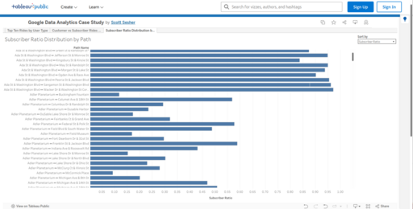

### Sheet 3: Subscriber Ratio Distribution by Path (Histogram)

<figure class="float-right" id="fig4">
  
  <figcaption>
  Figure 4: This histogram shows ride volumes for 88 station-to-station paths with over 10,000 total rides, sorted by combined ride count. Each bar is divided by user type: Subscribers (dark blue) and Customers (orange). The chart highlights which routes are commuter-heavy versus those with more balanced or customer-oriented traffic patterns. </figcaption>
</figure>

#### Overview
This histogram shows the distribution of 88 high-volume Divvy ride paths (each with at least 10,000 rides) based on the proportion of rides taken by Subscribers versus Customers. Each bar represents one bi-directional station-to-station path, with the length indicating the subscriber ratio (0% to 100%).

#### Key Interactions
- **Sort Toggle**: Switch between alphabetical sort and descending subscriber ratio.
- **Hover Tooltip**: Displays full path name, total ride count, and exact subscriber ratio for each path.
- **Color Coding**: Consistent color usage—dark blue for Subscribers, orange for Customers.

#### Purpose
To analyze the balance between Subscribers and Customers across major ride paths and to identify patterns in user type distribution that may correlate with route characteristics (e.g., commuter versus leisure).

#### Observations
- Several paths show extreme dominance by Subscribers, reaching ratios near or at 100%.
- A smaller number of paths are Customer-dominant, often near tourist attractions.
- Most paths fall into a mixed-use category, showing meaningful proportions of both user types.

#### Interpretation
High subscriber ratios often correspond to utilitarian, commute-heavy corridors such as between transportation hubs and business districts. Lower ratios are associated with recreational or tourist-centric routes, particularly those near lakefront parks or beaches.

This split offers insight into station planning, maintenance prioritization, and marketing opportunities. Understanding these asymmetries supports efforts to improve service for both core and casual user groups.

#### Data & Methods
- **Data Source**: [`reshaped_pairs.csv`](../data/provenance.qmd#reshaped_pairs-csv)
This reshaped dataset supports directional visualization of paired stations. See the data provenance document for generation steps and structure.
- **Path Aggregation**: Rides were grouped into bi-directional station pairs. Only paths with ≥10,000 combined rides were retained (88 total).
- **Subscriber Ratio**: Calculated as `subscriber_rides / (subscriber_rides + customer_rides)`.
- **Visualization Tool**: Tableau was used to create the histogram with interactive sorting and tooltips.
