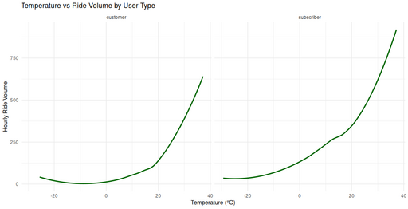

#### Temperature vs Ride Volume by User Type

<figure class="float-right">
  <a href="../images/Temp_vs_Ride_Volume_by_User_Type.png" target="_blank" title="Select image to open full sized chart">
  
  </a>
  <figcaption>
   Hourly ride volume by temperature, faceted by user type. Warmer temperatures correlate strongly with increased ride volume for both customers and subscribers, with subscriber volume remaining higher across all temperatures.
  </figcaption>
</figure>

##### Temperature vs Ride Volume by User Type

This dual-panel line plot compares **hourly ride volume** to **temperature (°C)** for **customers** (left) and **subscribers** (right). Both panels show a strong nonlinear increase in ride volume as temperatures rise.

###### Key Observations:
- Ride volume is **lowest below freezing** and begins to climb around 0°C.
- **Subscribers** maintain higher ride volume than customers across the full temperature range, suggesting greater resilience to cold weather.
- Both curves exhibit a **steep increase above 20°C**, peaking near 35–40°C.
- The growth is smooth and continuous, indicative of a nonlinear relationship rather than a threshold effect.

These findings support the inclusion of temperature as a continuous predictor of ride behavior in seasonal and temporal analyses.


```R
ggplot(rides_weather_df, aes(x = temp, y = rides)) +
     geom_smooth(method = "loess", se = FALSE, color = "darkgreen") +
     scale_y_continuous(labels = label_number(scale_cut = cut_short_scale())) +
     facet_wrap(~ user_type) +
     labs(
         title = "Temperature vs Ride Volume by User Type",
         x = "Temperature (°C)",
         y = "Hourly Ride Volume"
     ) +
     theme_minimal()
```
