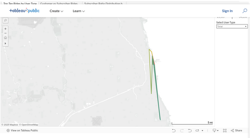

#### Sheet 1: Top 10 Rides by User Type (Map View)

<figure class="float-right" id="fig2">
  
  <figcaption>
  Figure 2: This interactive map shows the top 10 most frequently traveled station-to-station ride 
paths for the following rider groups; All Riders, Subscribers, or Customers. Line colors indicate r
ide volume, revealing distinct spatial usage patterns: casual riders concentrate near the lakefront
 and tourist zones, while subscribers follow more distributed, commuter-aligned routes. Click to op
en the full visualization in Tableau.
  </figcaption>
</figure>

#### Overview
This interactive map visualizes the top 10 most frequently traveled station-to-station ride paths for selected rider types: All Riders, Subscribers, or Customers. Each path is shown as a colored line on a Chicago map.
- Each line represents a frequently traveled path, regardless of direction.
- Line color corresponds to ride volume between those stations.
- Users can filter by rider type.

#### Key Interactions
- Use the control panel on the right to filter by rider type.
- Hover over a line to see ride count and station pair.
- Line color intensity reflects ride volume.

#### Purpose
To reveal spatial usage differences between rider categories and identify whether commuters and casual users favor different parts of the city.

#### Observations
- **Customers** cluster around the lakefront and tourist-heavy zones (e.g., Millennium Park, Theater on the Lake).
- **Subscribers** show a lot of activity around a small cluster of stations downtown and some very long north/south rides from those stations.
- Certain paths consistently appear in the top 10 across all rider types.

#### Interpretation
The map demonstrates that ride behavior is strongly influenced by rider intent. Customers tend to use routes near the lakefront and popular tourist zones. while Subscribers top usage if off the lakefront. These patterns confirm that spatial analysis can segment user types even without direct behavioral data.

#### Data & Methods
- **Data Source:** [`reshaped_pairs.csv`](../data/provenance.qmd#reshaped_pairs-csv)
  This reshaped dataset supports directional visualization of paired stations. See the data provenance document for generation steps and structure.
- **Path Aggregation**: Filtered to include only paths with ≥10,000 rides; grouped and counted by user type.
- **Visualization Tool**: Tableau was used to create the histogram with interactive sorting and tooltips.

