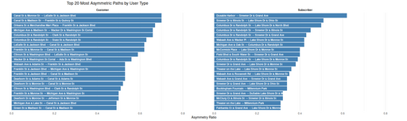

#### Top 20 Most Asymmetric Paths

<figure class="float-right">
  
  <figcaption>
    Top 20 most asymmetric ride paths by user type. Asymmetry ratio is calculated as the proportion of rides taken in one direction relative to the total rides between two stations. Distinct path preferences emerge between customers and subscribers.
  </figcaption>
</figure>

##### Overview

This side-by-side horizontal bar chart displays the **20 most directionally imbalanced station pairs** for each user type: **customers** and **subscribers**. These paths have the highest **asymmetry ratios**, indicating strong one-way usage patterns.

##### Chart Details

- **X-Axis**: Asymmetry Ratio (ranging up to ~1.0).
- **Y-Axis**: Station pair labels (listed within each bar).
- **Panels**:
  - **Left**: Top asymmetric paths for Customers.
  - **Right**: Top asymmetric paths for Subscribers.

##### Observations

- **Customers**:
  - Top asymmetric paths often involve major downtown locations such as Canal St, Clinton St, and Wacker Dr.
  - Patterns likely reflect tourism, drop-offs, or infrequent return trips.
- **Subscribers**:
  - Asymmetries cluster around recreational and waterfront areas such as Columbus Dr, Streeter Dr, Lake Shore Dr, Millennium Park, and McCormick Place.
  - Patterns suggest consistent commuting or recreational flows.

##### Interpretation

- **Asymmetry Ratio**:
  - Defined as:
    > rides in one direction / total rides between the two stations.
  - Values close to **1.0** mean most trips occur in a single direction.
- **Behavioral Insight**:
  - Customer asymmetry is oriented toward downtown ad hoc travel.
  - Subscriber asymmetry is more tied to commuting and lakefront destinations.
- **Comparison**:
  - Even when overlapping in geography, the dominant flow directions and endpoints differ between user groups.

##### Use Case

This visualization supports:

- Identifying rebalancing needs.
- Targeting incentive programs to encourage return trips.
- Understanding travel patterns for infrastructure planning and operational improvements.

