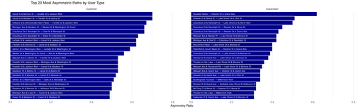

## Top 20 Most Asymmetric Paths by User Type 

<figure class="float-right">
  
  <figcaption>
  Top 20 bike-share station pairs with the most directional imbalance by user type. Customers show high asymmetry around central business district hubs, while subscriber asymmetries often reflect lakefront access or commuter endpoint behavior.
  </figcaption>
</figure>

### 📝 Image Notes

Title: Top 20 Most Asymmetric Paths by User Type
X-Axis: Asymmetry Ratio (from 0.0 to ~0.7)
Panels: Two side-by-side bar charts

-   Left panel: Top asymmetric paths for Customers
-   Right panel: Top asymmetric paths for Subscribers

### Interpretation

Asymmetry Ratio
:   A value approaching 1 indicates heavy one-way usage between a pair of stations.  Rides commonly occur in one direction but rarely the other.

Customer Patterns
:   Concentrated near transit stations and central business districts.  Reflect unidirectional use, possibly due to nearby public transit hubs, tourism drop-offs, or lack of return trips.

Subscriber Patterns
:   Focus on lakefront access (e.g., Streeter Dr, Lake Shore Dr) and commuter endpoints.  Suggest consistent commuting flows where riders may use other transportation methods for return trips (e.g., walking or transit).

Contrast
: While customers show asymmetry in the urban core, subscribers show it around recreational or edge areas.

