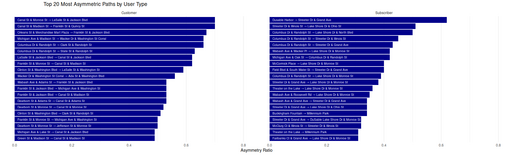

#### Top 20 Most Asymmetric Paths by User Type

<figure class="float-right" id="fig39">
  <a href="../images/Top_20_Most_Asymmetric_Paths_by_User_Type.png" target="_blank" title="Select image to open full sized chart">
  
  </a>
  <figcaption>
  Figure 39: Top 20 bike-share station pairs with the most directional imbalance by user type. Customers show high asymmetry around central business district hubs, while Subscriber asymmetries often reflect lakefront access or commuter endpoint behavior.
  </figcaption>
</figure>

##### Overview

This chart shows the **20 most directionally imbalanced station pairs** for **[Customers](../glossary.qmd#glossary-customer)** and **[Subscriber](../glossary.qmd#glossary-subscriber)**, ranked by asymmetry ratio. Each bar represents a station-to-station path where trips predominantly flow in one direction.

##### Chart Details

- **X-Axis**: Asymmetry Ratio (0.0 to ~0.7)
  - A higher value indicates more strongly one-way flows.
- **Y-Axis**: Station pairs, labeled inside the bars.
- **Panels**:
    - Left panel: Top asymmetric paths for Customers
    - Right panel: Top asymmetric paths for Subscribers

##### Observations

- **Customers**:
  - High asymmetry centered around central business district stations and transit hubs.
- **Subscribers**:
  - Strong asymmetry toward lakefront or edge-of-network destinations.
- **Contrast**:
  - Customer asymmetry is urban-core focused.
  - Subscriber asymmetry suggests recreation or commute endpoints.

##### Interpretation

Asymmetry Ratio
:   A value approaching 1 indicates heavy one-way usage between a pair of stations.  Rides commonly occur in one direction but rarely the other.

Customer Patterns
:   Concentrated near transit stations and central business districts.  Reflect unidirectional use, possibly due to nearby public transit hubs, tourism drop-offs, or lack of return trips.

Subscriber Patterns
:   Focus on lakefront access (e.g., Streeter Dr, Lake Shore Dr) and commuter endpoints.  Suggest consistent commuting flows where riders may use other transportation methods for return trips (e.g., walking or transit).

Contrast
: While Customers show asymmetry in the urban core, Subscribers show it around recreational or edge areas.


- Asymmetry highlights operational imbalances and user behavior patterns.
- Paths with high one-way traffic often require rebalancing or targeted incentives.

##### Use Case

Supports:

- Rebalancing plans.
- Infrastructure decisions.
- Targeted marketing to address directional demand.

##### R Code Used to Generate Chart

```r
ggplot(asym_top, aes(x = asymmetry_ratio, y = reorder(path_label, asymmetry_ratio))) +
    geom_col(fill = "darkblue") +
    geom_text(
        aes(label = path_label),
        x = 0.01,                   
        hjust = 0,                  
        color = "white",
        size = 2.7,
        fontface = "plain"
    ) +
    facet_wrap(~ user_type_label, scales = "free_y") +
    labs(
        title = paste("Top", top_n, "Most Asymmetric Paths by User Type"),
        x = "Asymmetry Ratio", 
        y = NULL
    ) +
    coord_cartesian(xlim = c(0, max(asym_top$asymmetry_ratio) + 0.10)) +
    theme_minimal(base_size = 11) +
    theme(
        plot.title = element_text(hjust = 0.1),
        axis.text.y = element_blank(),
        axis.ticks.y = element_blank(),
        panel.grid.major.y = element_blank()
    )
```

