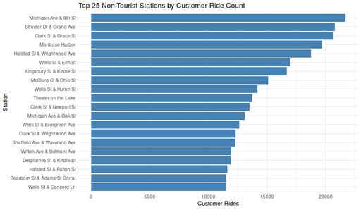

#### Top 25 Non-Tourist Stations by Customer Ride Count

<figure class="float-right">
  <a href="../images/Top_25_Non-Tourist_Stations_by_Customer_Ride_Count.png" target="_blank" title="Select image to open full sized chart">
  
  </a>
  <figcaption>
    Top 25 stations (excluding tourist locations) ranked by total customer ride volume. Bars highlight the most frequently used start locations among casual riders.
  </figcaption>
</figure>


##### Overview

This horizontal bar chart displays the **25 non-tourist stations with the highest number of customer rides**. Each bar represents a single station, ranked from lowest to highest.

##### Chart Details

- **X-Axis:** Station names (rotated vertically by using `coord_flip()`).
- **Y-Axis:** Number of customer rides originating at each station.
- **Bars:**
  - Colored steel blue.
  - Sorted so that the most-used stations appear at the top of the chart.

##### Observations

- The highest-ranking stations have significantly more rides than those near the bottom of the top 25.
- Usage distribution shows a steep drop-off after the first few most popular stations.
- This pattern suggests localized hubs of casual rider activity outside major tourist zones.

##### Interpretation

- Non-tourist stations can still accumulate large ride volumes, likely reflecting:
  - Proximity to residential neighborhoods.
  - Access to transit nodes or commercial areas.
  - Popularity among local users for short trips and errands.

##### Data Sources

- **Input Table:** Rides table in `caseStudy.db`.
- **Filters Applied:**
  - Only rides with `user_type = 1` (customers).
  - Start stations excluding predefined tourist station IDs.
  - Grouped and aggregated ride counts by start station.
  - Joined with station metadata to retrieve station names.

##### R Code Used to Generate Chart:

```R
ggplot(top_non_tourist_stations_named, aes(
   x = reorder(name, customer_ride_count),
   y = customer_ride_count
   )) +
   geom_col(fill = "steelblue") +
   coord_flip() +
   labs(
     title = "Top 25 Non-Tourist Stations by Customer Ride Count",
     x = "Station",
     y = "Customer Rides"
) +
theme_minimal()
```
