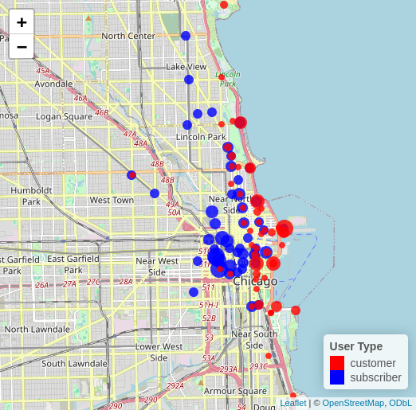

#### Top 50 Stations by User Type

<figure class="float-right">
  <a href="Top_50_Stations_by_User_Type.html" target="_blank" title="Select image to open full sized chart">
  
  </a>
  <figcaption>
  FIGCAPTION
  </figcaption>
</figure>


This interactive map of the top 50 stations includes the top 50 stations by number of subscriber rides and the top 50 stations by number of customer rides. We break from the normal color scheme as more contrast was required due to the preexisting colors in the map. So the dots for subscriber stations rendered in <span style="color: blue;">blue</span> and the dots for customer stations rendered in <span style="color: red;">red</span>. The dots for stations are offset slightly to avoid one dot obscuring the other for the cases where the station is in the top 50 for both subscribers and customers. This is accomplished by using a data frame where the location of the stations is offset. The size of the dots is scaled by the total number of rides (subscriber or customer as appropriate), so that stations with more rides are larger dots.

Generated with the following R command;

```R
leaflet(top_stations_df_offset) %>%
     addTiles() %>%
     addCircleMarkers(
         lng = ~long_offset,
         lat = ~lat,
         color = ~pal(user_type),
         radius = ~pmax(sqrt(ride_count) / 50, 4),
         stroke = FALSE,
         fillOpacity = 0.8,
         popup = ~paste0(
             "<b>", name, "</b><br>", "Rank: #", rn, "<br>",
             "User Type: ", user_type, "<br>",
             "Ride Count: ", format(ride_count, big.mark = ",")
         )
     ) %>%
     addLegend(
         position = "bottomright",
         pal = pal,
         values = ~user_type,
         title = "User Type",
         opacity = 1
     )
```

