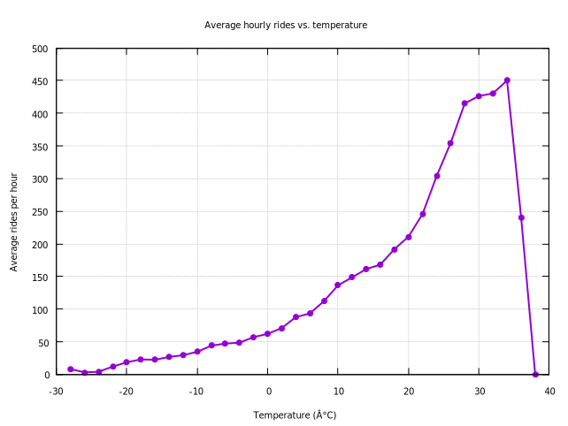

#### Average Hourly Rides vs Temperature (2° Buckets)

<figure class="float-right">
  <a href="../images/average_hourly_rides_vs_temp_2_bucket.svg" target="_blank" title="Select image to open full sized chart">
  
  </a>
  <figcaption>
  FIGCAPTION
  </figcaption>
</figure>


##### Overview
This chart presents the **average number of hourly bike rides** as a function of **temperature (°C)**. The data is aggregated across all users, without distinguishing between subscriber or casual rider types.

##### Chart Details

- **X-Axis**: Temperature in degrees Celsius, ranging from below -10°C to above 35°C.
- **Y-Axis**: Average hourly ride count.
- **Line**: A single curve showing average ride volume across all users, bucketed by temperature.

##### Purpose
This visualization is intended to illustrate how temperature alone affects overall ridership behavior, independent of time of day, day of week, or rider category.

##### Observations

- **Sub-zero temperatures (< 0°C)**: Very low ridership, close to zero, as expected.
- **Gradual increase**: Ride volume increases steadily with temperature from around 0°C to the low 20s.
- **Peak ridership**: Occurs near 25°C, representing the optimal weather for riding.
- **Drop-off above 30°C**: Suggests decreased willingness to ride in high heat, likely due to discomfort or health concerns.

##### Interpretation

- The chart suggests a strong correlation between temperature and total ride volume.
- The symmetric, bell-shaped curve implies that moderate temperatures are ideal for cycling.
- Extremes on either end (cold or hot) sharply reduce bike usage.

##### Technical Notes

- Rides are put into bucked with 2°C increments based on the temperature at ride start times. 
- The “2-bucket” term refers to the fact that the temperatures readings were grouped into bins of 2°C.  Binning is a form of data smoothing applied to reduce noise.

```SQL
.headers off          -- we only want raw numbers
.mode tabs            -- gnuplot likes tab‑ or space‑separated columns
.output temp_vs_rides.dat
WITH t AS (
  SELECT
    CAST(temp / 2.0 AS INT)*2  AS temp_bin,   -- 2 °C buckets: …, 14, 16, 18 …
    AVG(rides)                 AS avg_rides
  FROM rides_weather
  GROUP BY temp_bin
  ORDER BY temp_bin
)
SELECT temp_bin, avg_rides
FROM t;
.output stdout         -- restore console
```


```R
set title "Average hourly rides vs. temperature"
set xlabel "Temperature (°C)"
set ylabel "Average rides per hour"
set grid
set key off

# Simple connected line
plot "temp_vs_rides.dat" using 1:2 with linespoints lw 2 pt 7
```

