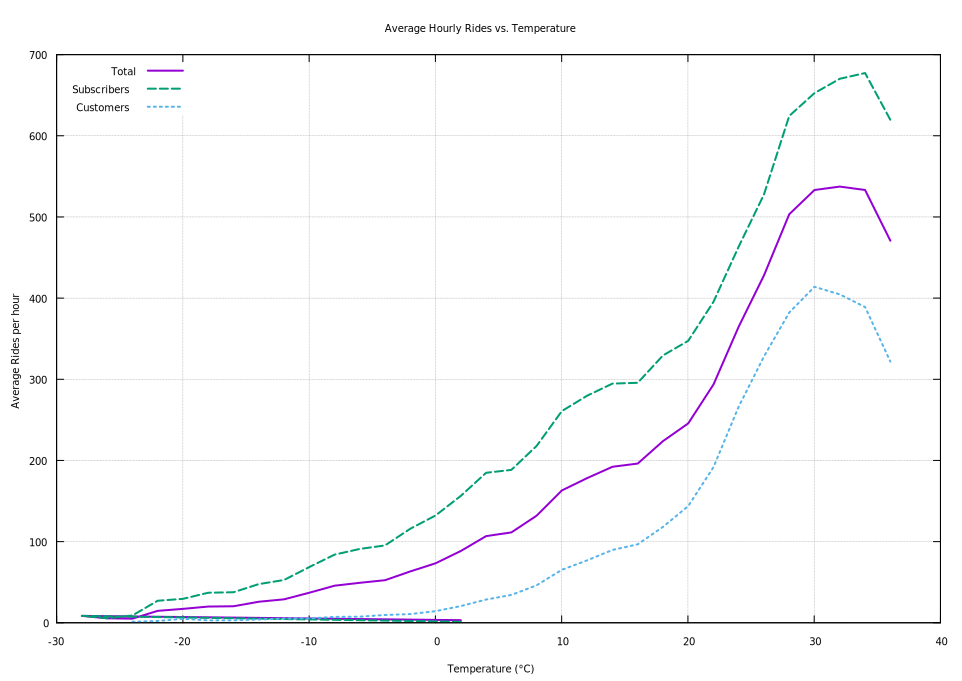

#### Average Hourly Rides vs. Temperature by User Type

<figure class="float-right">
  <a href="../images/average_hourly_rides_vs_temp_2_bucket_avg_sub_cust.svg" target="_blank" title="Select image to open full sized chart">
  
  </a>
  <figcaption>
    Average hourly ride counts by temperature (°C), separated by user type. Temperature is binned in 2-degree increments, with data recorded hourly.
</figure>

##### Overview

This line chart shows the **average number of rides per hour** as a function of temperature, separated by **subscribers** and **customers**. 

##### Chart Details

- **X-Axis:** Temperature in degrees Celsius (°C), binned in 2-degree increments.
- **Y-Axis:** Average rides per hour.
- **Lines:**
  - **Solid Line:** Total rides across both user types.
  - **Dashed Line:** Subscriber rides.
  - **Dotted Line:** Customer rides.

##### Observations

- Ride volume increases steadily from sub-zero temperatures up to ~25 °C.
- **Subscribers** consistently have higher hourly ride counts at all temperatures.
- Above 30 °C, total rides plateau rather than decline.
- The temperature effect is strong, reinforcing the importance of weather in ride behavior.

##### Interpretation

- The consistent gap between subscriber and customer lines suggests **subscribers are more temperature-resilient**.
- The plateau beyond 30 °C differs from some other plots where high heat reduced ridership. This could reflect aggregation smoothing or time-of-day confounding.
- Overall, this supports modeling temperature as a **key driver** of hourly ride volume.

##### Data Sources

- **Weather Data:** Hourly temperature records from Metostat.
- **Ride Data:** Aggregated hourly ride counts by user type from the main `rides` table.
- Data were pre-joined on hourly timestamp and grouped into **2 °C bins**.

##### Gnuplot Code Used to Generate Chart:

```gnuplot
set title  "Hourly rides vs. temperature"
set xlabel "Temperature (°C)"
set ylabel "Average rides per hour"
set grid
plot \
    "temp_vs_rides.tsv" using 1:2 with lines lw 2 title "Total", \
    ""                   using 1:3 with lines lw 2 dt 2  title "Subscribers", \
    ""                   using 1:4 with lines lw 2 dt 3  title "Customers"
```
