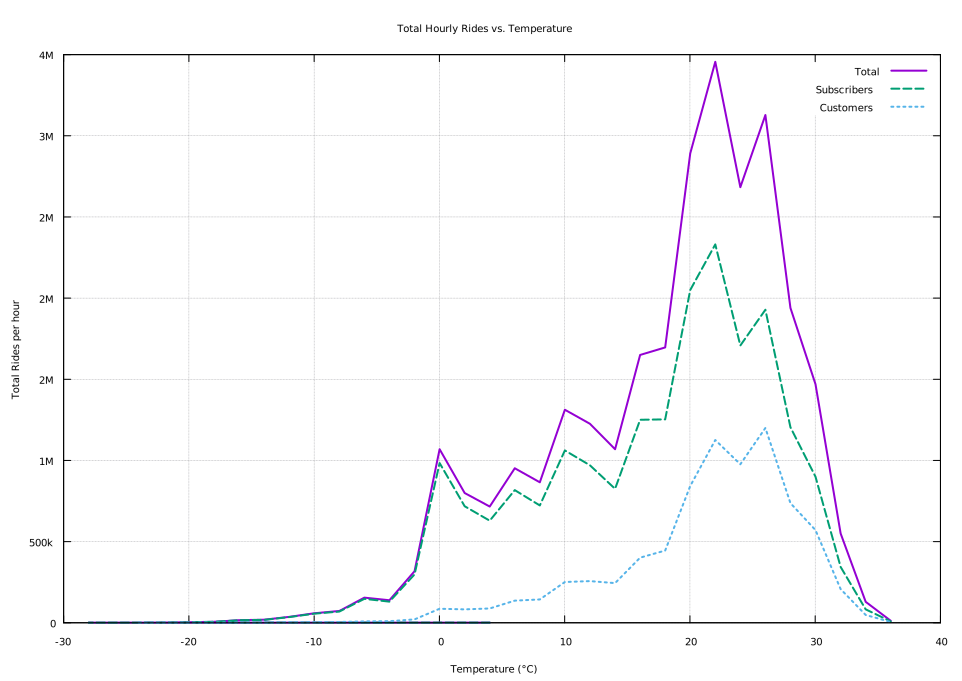

#### Total Hourly Rides vs Temperature by User Type (2°C Buckets)

<figure class="float-right">
  
  <figcaption>
  Total hourly rides by temperature bucket (2°C), separated by user type. Subscriber activity peaks more sharply in moderate to warm temperatures, while Customer rides increase more steadily with temperature. Data aggregated across all non-loop rides.
  </figcaption>
</figure>

##### Overview

This chart shows how total rides vary with temperature, split between **Subscribers** and **Customers**. Ride counts are aggregated by temperature buckets, offering a side-by-side view of weather sensitivity by user group.

##### Chart Details

- **X-Axis**: Temperature in degrees Celsius, grouped into 2°C buckets.
- **Y-Axis**: Total number of rides aggregated per hourly bin across the dataset.
- **Lines**:
  - **Subscribers**: Typically exhibit a sharper peak in moderate temperature ranges.
  - **Customers**: Show a more gradual increase in ride volume as temperatures rise.

##### Purpose

The visualization helps compare how different user types respond to temperature changes. It reveals behavioral distinctions between Subscribers and Customers.

##### Observations

- **Subscribers**:
  - Low ride volume below 10°C.
  - Sharp peak near 25°C, suggesting strong commuting patterns tied to comfort.
  - Rapid decline above 30°C, possibly due to heat discomfort.
  
- **Customers**:
  - More gradual increase in ride volume with rising temperatures.
  - Peak also around 25–30°C, but less steep rise and fall.
  - Greater relative tolerance for warmer temperatures.

##### Interpretation

- **Subscriber behavior** is more concentrated and sensitive to moderate temperatures, likely tied to commuting habits.
- **Customer rides** are more distributed across a range of temperatures, aligning with recreational or discretionary use.
- The divergence in curve shapes supports the hypothesis of different underlying motivations between user groups.

##### Technical Notes

- Temperatures are binned into 2°C increments based on conditions at the start of each ride.
- Rides were grouped and summed by user type for each temperature bin, then aggregated hourly.

  

